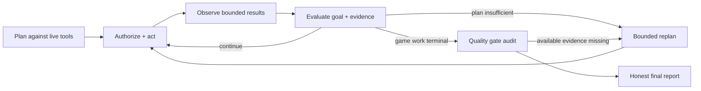
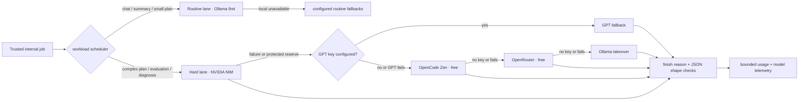

<div align="center">

# NEX // DUAL-ENGINE AGENT STUDIO

### A local-first production operator for **Unreal Engine 5.8** and **Roblox Studio**—with a face, a hard MCP boundary, and zero patience for fake completion.

**INSPECT → PLAN → AUTHORIZE → BUILD → PLAY → OBSERVE → PROFILE → PROVE**<br>
<sub>Unreal 5.8 + Roblox Studio first · Python standard library · zero frontend build · no hidden computer access</sub>

<br>


<br>

**Not another chatbot with a tool button. A bounded production system that has to show its work.**

</div>

<p align="center">
  
</p>
<p align="center"><sub>
Real tools. Real screens. Real evidence. Photo by
<a href="https://unsplash.com/@jakubzerdzicki?utm_source=nex&utm_medium=referral">Jakub Żerdzicki</a>
on <a href="https://unsplash.com/photos/screens-display-coding-text-representing-programming-work-gCyjEr-g2oI?utm_source=nex&utm_medium=referral">Unsplash</a>.
This is editorial photography, not a Nex screenshot.
</sub></p>

---

## Read this first

Nex has three non-negotiable opinions:

1. **Unreal Engine 5.8 and Roblox Studio deserve real production workflows** —
   not the same generic “make game” prompt with a different logo;
2. **software should feel alive** — the interface is an expressive WebGL face,
   not a spinner taped to a form; and
3. **an agent must earn “done”** — every external action crosses one visible,
   policy-gated MCP boundary, and every ambitious result ends in evidence, not
   celebratory prose.

Nex now treats **Unreal Engine 5.8** and **Roblox Studio** as first-class,
separate production targets. It detects the target from the goal and, cautiously,
from unmistakable live MCP namespaces. It applies engine-specific architecture,
security, test, performance, and shipping contracts; shows a separate readiness
score for each editor; and records the target profile in run events and reports.

Other MCP servers still work. Blender, source control, DCC, asset, build-farm,
and internal-engine tools remain welcome collaborators. But the game-production
brain is optimized around the two editor ecosystems above. Nex discovers the
live surface, plans only with tools that exist, validates a dependency graph,
executes approved calls, carries structured outputs forward, inspects results,
repairs bounded failures, and reports exactly what was proven.

> [!IMPORTANT]
> **“AAA” is a production ambition, not a magic adjective.** Nex can run the
> discipline: inspect, slice, integrate, build, play, capture, review, diagnose,
> verify, profile, and polish. It cannot hallucinate engine features, art
> direction, licensed assets, compute, time, or taste. If the connected MCP
> surface cannot prove the result, Nex does not claim it.

### Jump to the good part

| I want to… | Go here |
| --- | --- |
| launch Nex in under a minute | [Quick start](#quick-start) |
| see the Unreal 5.8 contract | [Unreal Engine 5.8](#unreal-engine-58--blueprints-c-pie-cook-proof) |
| see the Roblox contract | [Roblox Studio](#roblox-studio--luau-authority-multi-client-proof) |
| understand the “make GTA 7” behavior | [The studio program](#from-make-gta-7-to-an-actual-production-program) |
| see why a green tool call is not enough | [Evidence gates](#the-nine-evidence-gates) |
| understand the production-grade MCP core | [MCP production intelligence](#mcp-production-intelligence) |
| understand NVIDIA NIM routing | [NIM flight deck](#nvidia-nim-flight-deck) |
| run Nex on 100% free cloud models, no card | [Five providers, one code path](#five-providers-one-code-path) |
| audit the safety boundary | [Security model](#security-model) |
| connect an engine MCP correctly | [MCP server contract](#what-a-capable-game-engine-mcp-server-should-expose) |
| configure everything | [Configuration reference](#configuration-reference) |
| verify the claims | [Tests](#tests) |

### The 20-second architecture

```text
YOU
 │
 ├── talk ──> CHAT BRAIN ─────────────────────────────────────────┐
 │                                                               │
 └── act ───> AGENT BRAIN ─> validated task graph                │
                              │                                  │
                              ▼                                  │
                       policy + approval                          │
                              │                                  │
                              ▼                                  │
                   ONE MCP ACTION BOUNDARY                        │
                              │                                  │
                  ┌───────────┼──────────────┐                   │
                  ▼           ▼              ▼                   │
            Unreal 5.8   Roblox Studio   support servers         │
                  │           │              │                   │
                  └───────────┴──────────────┘                   │
                              │                                  │
                           evidence                              │
                              │                                  │
                              ▼                                  │
                honest result: complete / partial / blocked <────┘
```

| What changes | What never changes |
| --- | --- |
| provider, model, engine, tools, project, goal | MCP is the only action path |
| plan size and production stage | code—not prompt text—owns authority |
| available evidence and quality score | unavailable proof never becomes “passed” |
| NIM/GPT/OpenCode Zen/OpenRouter/local provider serving a call | failover never rewrites the build plan |

## Connecting the first-party engine MCP servers

Both target engines now ship MCP support from the engine maker itself — no
community bridge required.

### Unreal Engine 5.8 — Epic's `ModelContextProtocol` plugin

Enable **Unreal MCP** (plus **AllToolsets**) in *Edit > Plugins*, then switch on
*Edit > Editor Preferences > General > Model Context Protocol > **Auto Start
Server***. The server binds to `http://127.0.0.1:8000/mcp`. Add it in Nex under
Capabilities as an HTTP server pointing at that URL.

> **Turn OFF “Enable Tool Search.”** It defaults to **on**, and in that mode
> `tools/list` returns only three meta-tools — `list_toolsets`,
> `describe_toolset`, `call_tool` — instead of the real schemas. Nex stays safe
> either way (see below), but with the real tools hidden it cannot classify
> quality gates, detect engine readiness, or plan deterministically. Nex reports
> this as `dispatcher_advice` in server health.

Epic ships this as **Experimental**: APIs and data formats may change, there is
**no authentication layer**, and it is localhost-only by design. Tool calls also
execute **serially on the game thread**, so clients must not issue overlapping
calls — Nex already executes one MCP call at a time per server.

### Roblox Studio — the built-in MCP server

Modern Studio has an MCP server **built in**; enable it from Assistant's MCP
settings. (The older open-source `Roblox/studio-rust-mcp-server` still works but
is no longer the recommended path.) Roblox's own guidance is the short version of
this entire README: **only connect clients you trust.**

### How Nex handles a generic tool dispatcher

A wrapper like `call_tool` performs a *different action on every call*. Treating
it as one tool would be a capability-confusion hole: the shell denylist would
inspect the wrapper and never see `run_command`, and a single “always allow”
would silently cover every tool behind it. So `mcp/policy.py` resolves the
dispatcher **before any other rule runs**:

| Call | Verdict |
| --- | --- |
| `call_tool{name: "run_command"}` | **denied** — denylist matches the inner name |
| `call_tool{name: "delete_actor"}` | `destructive` → confirmation |
| `call_tool{name: "spawn_actor"}` | `create` → proceeds |
| `call_tool{name: "get_output_log"}` | `read` → proceeds |
| `call_tool` with no inner name | **denied** — Nex will not authorize an unidentified action |
| `call_tool{name: "call_tool"}` | **denied** — dispatchers may not nest |

Approvals bind to the **dispatched** tool, never to the wrapper: approving
`call_tool` itself grants nothing. Escape-payload scanning reaches into the
nested `arguments` object too.

## Two editors. Two contracts. One honest boundary.

“Game engine support” often means a model was told which brand name to repeat.
Nex takes the opposite approach. `agent/engines.py` contains two deterministic
production profiles. A profile contributes all of the following:

- **target detection** from explicit goal language and unmistakable live MCP
  namespaces—not from untrusted tool descriptions;
- **planning rules** that use the engine's real architecture and vocabulary;
- **capability readiness** measured separately across inspection, authoring,
  runtime, observation, testing, performance, persistence, and shipping work;
- **run metadata** so the UI and final report identify which production contract
  was active; and
- **hard honesty** when the connected tools cannot open the editor, compile the
  project, start a session, capture a viewport, inspect logs, or ship.

| Production concern | Unreal Engine 5.8 | Roblox Studio |
| --- | --- | --- |
| project truth | `.uproject`, `EngineAssociation`, modules, plugins, assets, levels | place/DataModel, services, Instances, scripts, packages |
| code/content split | C++ modules + Blueprints + cooked content | server Luau + client Luau + replicated Instances |
| runtime proof | PIE or standalone session | Studio server plus clients / appropriate play mode |
| diagnostics | Output Log, Message Log, Blueprint/C++ build output | Studio Output, script analysis, Developer Console |
| visual proof | viewport or runtime capture, then visual review | Studio/client capture, then visual review |
| performance | Unreal Insights, traces, stat data, target build | MicroProfiler, Script Profiler, memory/network/device data |
| release proof | build, cook, package, target-platform launch | saved place, publish approval, post-publish checks |
| biggest trap | “asset saved” is not “compiled/package works” | “Play Solo passed” is not “multi-client/live works” |

The **Capabilities** screen shows two readiness cards. A score means “named live
MCP tools cover these disciplines”; it does **not** mean an editor is currently
open, the project is healthy, or the game is shippable. Descriptions advertised
by an MCP server do not count as capability evidence. Exact tool namespaces and
machine-observed results do.

When a goal explicitly targets both engines, Nex keeps their project state,
identifiers, assets, sessions, tests, and acceptance evidence separate. A Roblox
Instance path must never leak into an Unreal task, and an Unreal object path must
never be offered to Studio.

<p align="center">
  
</p>
<p align="center"><sub>
Production means looking at the real project, not imagining one. Photo by
<a href="https://unsplash.com/@karlp?utm_source=nex&utm_medium=referral">Karl Pawlowicz</a>
on <a href="https://unsplash.com/photos/a-computer-monitor-sitting-on-top-of-a-wooden-desk-gbRaa67fEPo?utm_source=nex&utm_medium=referral">Unsplash</a>.
Editorial photography—not a Nex screenshot.
</sub></p>

## Unreal Engine 5.8 — Blueprints, C++, PIE, cook, proof

The Unreal profile is pinned to **5.8**. A planner must first inspect the live
project and confirm its `EngineAssociation`; it must never silently convert an
older project or assume a newer one is compatible. The discovery pass should
look at the `.uproject`, target platform, enabled plugins, `Source` modules,
`Content`, asset registry, current levels/worlds, World Outliner, project
settings, source-control state, and relevant logs before changing anything.

### The Unreal production contract

1. **Respect the existing architecture.** Preserve module boundaries, project
   naming, asset paths, source-control conventions, and the project's chosen
   C++/Blueprint split. Do not replace stable project systems merely because a
   fresh implementation is easier to prompt.
2. **Treat UE 5.8 features as tools, not confetti.** World Partition, PCG,
   Nanite, Lumen, MegaLights, Dataflow, Control Rig, Common UI, and the broader
   5.8 toolset are selected only when the project, platform, and goal justify
   them. Experimental features—including Mesh Terrain—are opt-in and require
   the relevant plugin and risk decision.
3. **Compile what changed.** Modified Blueprints must compile. Affected C++
   targets must build. Broken references, redirectors, warnings, and Output Log
   errors remain defects even if the editor accepted a save.
4. **Prove gameplay in a runtime.** Opening a level or moving an Actor in the
   editor is not a playtest. Nex asks for a real PIE or standalone path with the
   expected player start, input, state transition, failure/restart behavior, and
   representative interaction.
5. **Separate editor proof from release proof.** PIE success does not prove a
   cook. A cook does not prove packaging. A package does not prove launch on the
   target hardware. Each claim needs its own available MCP action and result.
6. **Observe and profile.** Capture a viewport/runtime frame, inspect Output Log,
   run automation or functional tests, and use Unreal Insights/trace/stat
   evidence where live tools expose them.

A useful Unreal MCP surface therefore exposes recognizable operations for:

```text
inspect .uproject / engine version / modules / plugins
list assets / levels / actors / components / references
create or edit Actors / Components / Blueprints / materials / systems
compile Blueprints / build C++ targets / cook / package
start and stop PIE or standalone sessions
capture viewport / read Output Log / collect diagnostics
run Automation, Functional, or Gauntlet-style tests
capture Unreal Insights or equivalent frame/memory/CPU/GPU evidence
```

Nex does not require those exact spellings; it matches a bounded engine
vocabulary against discovered `server.tool` names. It prints the exact available
names into the planning contract and marks missing disciplines as unavailable.

Example goal:

```text
“In this Unreal Engine 5.8 project, inspect the .uproject, enabled plugins,
current World Partition map, existing locomotion Blueprints, and Output Log.
Build one production-quality traversal encounter using the existing framework.
Compile every changed Blueprint and C++ target, run it in PIE, capture the
viewport, inspect logs, run the available functional test, profile the frame,
and report packaging as unverified unless you actually package the target.”
```

Useful primary references:

- [Unreal Engine 5.8 release notes](https://dev.epicgames.com/documentation/unreal-engine/unreal-engine-5-8-release-notes)
- [Unreal Engine testing and optimizing](https://dev.epicgames.com/documentation/unreal-engine/testing-and-optimizing-your-content)
- [Unreal Insights](https://dev.epicgames.com/documentation/unreal-engine/unreal-insights-in-unreal-engine)

> [!NOTE]
> UE 5.8 can provide MCP-facing editor capabilities, but Nex does not bundle,
> install, or secretly bypass an Unreal MCP server. The operator connects and
> trusts that server; the server decides what editor operations actually exist.

## Roblox Studio — Luau, authority, multi-client proof

The Roblox profile begins with the live **DataModel**, not a blank-script
fantasy. Discovery should map services, Instances, scripts and ModuleScripts,
packages, tags/attributes, collision groups, StreamingEnabled behavior, existing
framework conventions, and which code runs on the server versus the client.

### The Roblox production contract

1. **The server is authoritative.** Clients can request; they do not award
   currency, accept impossible movement, choose arbitrary inventory records, or
   dictate damage. Every RemoteEvent and RemoteFunction argument is untrusted
   input and must be type-, range-, permission-, state-, and rate-validated on
   the server.
2. **Replication boundaries are architecture.** Server-only logic and secrets
   stay in server containers. Shared contracts belong in deliberate replicated
   locations. Client code is considered observable by an attacker. Typed Luau,
   narrow modules, explicit lifecycle/cleanup, and deterministic resets are
   preferred over one giant script.
3. **Play Solo is not multiplayer proof.** Relevant work should run with a
   Studio server and multiple clients. Nex asks for server and client Output,
   Remote behavior, join/leave/rejoin paths, race conditions, ownership, and
   exploit-shaped invalid requests—not merely a clean solo spawn.
4. **Protect persistence during tests.** Studio access can reach real data when
   enabled. DataStore work uses a separate test version or isolated keys and
   guarded server-side operations. Migration, retry, budget, failure, and
   shutdown behavior need explicit evidence.
5. **Test streaming and devices honestly.** StreamingEnabled changes what a
   client can see and when. Desktop Studio success cannot prove low-memory
   mobile behavior, touch controls, thermals, network quality, or loading time.
   Device emulation and real-device Developer Console/MicroProfiler evidence are
   separate claims.
6. **Save and publish are different verbs.** Publishing is a network action,
   stays policy-gated, and may require exact-call operator approval. A successful
   local save never becomes a published-production claim.

A useful Roblox MCP surface therefore exposes recognizable operations for:

```text
inspect DataModel / services / descendants / properties / script ownership
create and modify Instances / terrain / UI / Script / LocalScript / ModuleScript
read and write typed Luau source through bounded editor operations
inspect RemoteEvents / RemoteFunctions / replication boundaries
start Studio play modes / local server / multiple clients
capture viewport / read server+client Output / run script analysis
run TestService, unit, integration, and invalid-remote checks
inspect DataStore test isolation / StreamingEnabled behavior
capture MicroProfiler / Script Profiler / memory / network / device evidence
save place / request separately approved publish / observe post-publish health
```

Example goal:

```text
“In Roblox Studio, inspect the current DataModel and module ownership before
editing. Build a polished co-op round loop with typed Luau. Keep scoring and
inventory server-authoritative, validate and rate-limit every RemoteEvent, use
isolated test persistence, then run a server with three clients. Review server
and client Output, test join/leave/rejoin and malformed remote requests, inspect
streaming behavior, capture a representative client view, profile it, and do not
publish without a separate approval.”
```

Useful primary references:

- [Remote events and callbacks](https://create.roblox.com/docs/scripting/events/remote)
- [Server-side detection and consequencing](https://create.roblox.com/docs/scripting/security/server-side-detection)
- [Data stores](https://create.roblox.com/docs/cloud-services/data-stores)
- [Instance streaming](https://create.roblox.com/docs/workspace/streaming)
- [Test on hardware](https://create.roblox.com/docs/performance-optimization/test-on-hardware)
- [MicroProfiler](https://create.roblox.com/docs/studio/microprofiler)

> [!WARNING]
> A Studio green check is not evidence of live-service correctness. Real device,
> regional network, production DataStore budget, moderation, rollout, analytics,
> and live concurrency remain unverified until an appropriate connected tool or
> operator proves them.

## Quick start

```bash
git clone https://github.com/Qynl/Nexofficial.git
cd Nexofficial/nex
python3 server.py
```

Open the URL printed in the terminal—normally `http://localhost:8787`. The one-time URL exchanges its token for an `HttpOnly`, `SameSite=Strict` cookie and removes the token from the address bar.

Nex binds **loopback only** by default, so starting it does not publish the console to your Wi-Fi network. Set `NEX_HOST` if you really want remote access—you will get a warning at startup, and an SSH tunnel is the better answer.

There is no `pip install`, `npm install`, bundler, migration command, or frontend build step. Nex uses:

- Python’s standard library for HTTP, SQLite, concurrency, and transport;
- browser-native WebGL, Web Speech, modules, and CSS;
- local Ollama, NVIDIA NIM, or another OpenAI-compatible model endpoint; and
- MCP servers for **every** real-world action.

Choose a workload route—or do nothing and use the local default:

```bash
# Local-only
export OLLAMA_MODEL=gpt-oss:20b

# NVIDIA NIM for hard work; routine chat/plans remain local
export NVIDIA_API_KEY=nvapi-your-key
export NEX_AGENT_PROVIDER=nim
export NEX_AGENT_MODEL=nvidia/nemotron-3-super-120b-a12b
```

Then:

1. Open **Settings → Model** and verify the **Smart workload scheduler**.
2. Start the MCP server/plugin that is already integrated with your editor.
3. Open **Capabilities → Add server** and connect its documented HTTP endpoint
   or stdio command. Give it an honest namespace such as `unreal_editor` or
   `roblox_studio`; Nex does not guess vendor commands or ports.
4. Keep the server untrusted until you have reviewed its discovered tools,
   schemas, annotations, and Nex classifications.
5. Check the separate **Unreal Engine 5.8** and **Roblox Studio** readiness cards.
   Missing runtime or observation coverage is a real gap, not a setup warning to
   click through.
6. Ask Nex to do something, then watch the run card name the engine target and
   tell the truth in real time.

```text
UNREAL
“Build a polished UE 5.8 vertical slice for the abandoned observatory.
Reuse existing movement and materials. Compile every affected Blueprint/C++
target; run PIE; capture the viewport; inspect Output Log; profile the frame;
and report cook/package as unverified unless those tools really run.”

ROBLOX
“Build a polished three-player observatory escape in Roblox Studio. Inspect the
DataModel first, validate all client remotes on the server, test with one server
and three clients, review both Outputs, test streaming and restart behavior,
capture a client view, profile it, and leave publishing for explicit approval.”
```

Those are the kinds of prompts the production protocol is designed to
handle—**provided the connected MCP tools can actually inspect, edit, run,
capture, verify, profile, and (when requested) ship the project**.

## What Nex is

| Layer | What it does | What it deliberately does not do |
| --- | --- | --- |
| **Presence** | WebGL face with idle, listening, thinking, speaking, planning, working, and verifying states | Fake activity with decorative progress |
| **Conversation** | Streaming chat, markdown, code blocks, voice, search, regeneration, persistent history | Send provider secrets to the browser |
| **Agent loop** | Plans a DAG, executes ready tasks, records evidence, evaluates, recovers, replans, and summarizes | Treat “the tool returned” as “the goal is complete” |
| **Engine profiles** | Detects Unreal 5.8 / Roblox Studio, injects separate production contracts, scores live MCP coverage, and records targets | Pretend a profile is an editor connection |
| **Studio program** | Breaks whole-game/open-world goals into eight separately planned production stages with cross-stage dataflow | Confuse one vertical slice with a finished giant game |
| **Game-production protocol** | Applies capability-aware quality gates and a bounded corrective pass to game-authoring goals | Promise artistic, commercial, or literal AAA quality |
| **MCP boundary** | Discovers and calls operator-connected tools through one manager/policy/audit path | Expose a built-in shell, filesystem, terminal, or arbitrary host tool |
| **Operator controls** | Exact-call approvals, session approvals, server trust, category policy, budgets, cancellation | Let the model grant itself permissions |

## From “make GTA 7” to an actual production program

A city-scale game is not a 16-step task. Nex now recognizes whole-game,
open-world, MMO, sandbox, and similarly large requests and switches from a
single DAG to the hierarchical studio program in `agent/production.py`.

| Stage | Production question |
| --- | --- |
| **1. Discovery & constraints** | What project, engine state, reusable systems, assets, conventions, platforms, and hard constraints actually exist? |
| **2. Production foundation** | What architecture, data model, input/state/save/restart paths, and acceptance contracts can carry the game rather than a demo? |
| **3. Playable vertical slice** | Can one small experience deliver traversal, interaction, challenge, feedback, UI, audio, and recovery at representative quality? |
| **4. Scalable game systems** | Can proven foundations support missions, vehicles, AI, combat, economy, streaming, progression, and their edge cases? |
| **5. World, content & presentation** | Does representative breadth have coherent art direction, lighting, animation, audio, navigation, landmarks, and pacing? |
| **6. Full-loop integration** | Do start-to-finish player journeys survive system boundaries, save/load, failure, UI, controls, and accessibility paths? |
| **7. Validation & optimization** | Do real builds, play sessions, captures, visual reviews, logs, tests, and profiles meet explicit targets? |
| **8. Evidence-driven polish** | Can the highest-impact observed defects be fixed and the affected checks rerun without endless random tweaking? |

Each stage gets a fresh 3–8 step plan against the live catalog. Successful
steps from earlier stages remain in the graph and expose `$step.field` outputs
to later stages; they are not replayed just to recover an ID. New task IDs are
namespaced per milestone, so an eight-stage build cannot collide with its own
history.

Stage completion is machine-audited too. Discovery must contain inspection
evidence; a vertical slice must show implementation, gameplay, presentation,
UI, and an actual play session; systems/world/integration stages require their
relevant production disciplines; validation must independently build, run,
capture, visually review, inspect diagnostics, verify, and profile. Every
milestone also has a minimum number of distinct relevant successful steps, so
one conveniently named “do everything” call cannot certify a whole stage. If an
available requirement was omitted, Nex makes a bounded corrective plan for
that stage. If the capability is unavailable, the program stops partial rather
than advancing on vibes. The run card shows the current stage, evidence gaps,
progress rail, and connected MCP production-readiness score.

Readiness covers both proof capabilities—inspect, build, run, capture, visually
review, diagnose, test, profile—and practical disciplines such as world
authoring, gameplay, AI/navigation, presentation, UI/accessibility, and
save/progression data. Missing implementation, playtest, visual capture, or
visual-review tools are hard readiness blockers. This does not stop useful work;
it stops Nex from calling a thin editor bridge a virtual game studio.

The program remains bounded: 64 tool calls, eight production stages, three
structural replans, one final evidence/polish pass, and a 30-minute wall clock by
default. If any stage cannot be planned or completed, the result is `partial`,
not “GTA finished.” Those limits are configurable for an operator who really
has the engine automation and compute to support a larger campaign.

## The game-production quality protocol

Most “AI made a game” demos stop after files exist. Nex asks a less flattering and much more useful question:

> **What independent evidence do we have that this is a coherent, playable, stable result?**

For game-authoring requests, `agent/quality.py` derives a production contract from the **goal plus the live MCP catalog**. It is engine-agnostic and deterministic. A tool is never invented because a workflow would look nicer with it.

### The nine evidence gates

| Gate | What counts | What does **not** count |
| --- | --- | --- |
| **Inspection** | A successful project/scene/hierarchy/state inspection tool | Assuming the project is empty or follows a familiar template |
| **Implementation** | Successful create/modify/code integration calls | A written plan or generated prose |
| **Build** | A successful compile, build, bake, cook, or package call | “The script was saved” |
| **Playtest** | A real runtime, simulation, PIE, or editor play session | Build success by itself |
| **Visual capture** | A screenshot, captured frame, viewport image, or rendered preview | Inferring appearance from JSON like `{ "ok": true }` |
| **Visual review** | A separate visual-analysis, screenshot-review, comparison, or defect-check tool | Treating possession of a screenshot as evidence that anyone inspected it |
| **Diagnostics** | Runtime logs, console output, errors, warnings, or crash diagnostics reviewed | A process merely starting |
| **Verification** | A verification, validation, automation, functional, integration, or acceptance check | The implementation tool reporting its own success |
| **Performance** | Profiling, frame-time/FPS, memory/GPU stats, telemetry, or benchmark evidence | “It felt fast” without a measurement |

A normal production game-making run requires the first eight. A **flagship** request—terms such as “AAA-style,” “high-quality,” “professional,” “shippable,” or “cinematic”—also requires performance evidence. Visual capture and visual review are deliberately separate: pixels existing is not the same as those pixels being judged.

The final report contains a score from `0–100`, gate-by-gate state, supporting step/tool evidence, missing gates, unavailable capabilities, and the number of corrective passes. A gate can be:

- `passed` — a successful task used a live tool that supports this evidence;
- `not_run` — an appropriate tool existed, but the plan did not use it; or
- `unavailable` — the connected MCP catalog did not expose such a capability.

Structured negative verdicts such as `{"playable": false}`, `{"valid": false}`,
non-empty `errors`, or a failed `status` are rejected as positive evidence even
when transport succeeded.

An **empty** success is rejected too. For every gate except implementation, the
call must return an inspectable payload: `null`, `{}`, and empty content no
longer turn a gate green, because a reply with nothing in it cannot prove a
build, a play session, a screenshot review, a log inspection, a test, or a
profile. Implementation is the deliberate exception—an authorized mutation is
itself the action—and downstream gates still have to prove it worked.

Unavailable does **not** quietly become passed. If a plan omitted an available gate, Nex can make **one bounded corrective plan** by default. Completed implementation history is preserved, task IDs are safely namespaced, and the corrective prompt explicitly says not to redo successful work. No infinite “just one more polish pass” spiral at 3 a.m.

```json
{
  "tier": "flagship",
  "score": 78,
  "passed": false,
  "missing": ["visual_review", "performance"],
  "unavailable": ["performance"],
  "correctable": ["visual_review"],
  "disclaimer": "This score measures MCP-backed production evidence, not artistic taste, market readiness, or guaranteed AAA quality."
}
```

The UI renders this as a **Production evidence** panel inside the live run card. Green gates are supported by completed calls; amber gates still need work; dim gates are impossible with the current tool surface.

### How a strong game run unfolds

```text
DISCOVER    Read the live MCP catalog; classify what can inspect/edit/run/observe.
    ↓
INSPECT     Understand the existing project, conventions, assets, and constraints.
    ↓
CONTRACT    Turn the request into concrete acceptance criteria.
    ↓
SLICE       Build the smallest coherent playable experience before adding breadth.
    ↓
INTEGRATE   Connect gameplay, content, UI, audio, state, and failure/restart paths.
    ↓
BUILD/RUN   Compile or package where relevant, then enter a real play session.
    ↓
OBSERVE     Capture visuals; inspect logs and diagnostics; profile when available.
    ↓
VERIFY      Check acceptance criteria with evidence independent of implementation.
    ↓
POLISH      Make one bounded, high-impact corrective pass if an available gate was missed.
    ↓
REPORT      Separate implemented, built, played, seen, measured, and still unknown.
```

This ordering matters. A screenshot is not a test. A test is not a play session. A play session is not a profiler. Keeping those claims separate is how Nex becomes more autonomous **without becoming more delusional**.

### What a capable game-engine MCP server should expose

Nex does not require these exact names—the classifier understands common editor vocabulary—but a productive server should offer semantic tools in roughly these families:

```text
inspect_project / inspect_scene / get_hierarchy / actor_details
create_level / add_actor / set_component_property / create_asset
compile_project / build_game / bake_lighting / cook_content
run_game / play_in_editor / start_pie / run_playtest
capture_frame / screenshot_viewport / render_preview
analyze_screenshot / inspect_visual / visual_diff / review_frame
inspect_logs / console_output / get_diagnostics
verify_game / automation_test / functional_test
get_performance_metrics / profiler_capture / benchmark
```

Prefer narrow, schema-rich engine actions over a generic `run_command`. Nex categorically denies shell/process tools anyway. Purpose-built calls produce better plans, safer approvals, stronger audit records, and more honest quality evidence.

## MCP production intelligence

The MCP boundary is not merely where actions happen; it is the production
substrate. If this layer gives the planner 100 vaguely named mutation tools and
hides the one profiler, Nex will produce more content and less truth. The MCP
production layer in `agent/mcp_production.py` addresses that failure mode before
execution.

### 1. Balanced capability portfolios

Ordinary lexical ranking overweights words from the goal. A request containing
“city,” “vehicle,” and “combat” can fill the entire prompt with authoring tools
while omitting PIE, multi-client play, screenshots, logs, tests, or profiling.
Production catalog selection reserves bounded space for:

```text
inspection → implementation → build → runtime → capture → visual review
                                  └──── diagnostics / verification / profiling
```

It also reserves exact tools from the active Unreal or Roblox profile and a
small representative set from each capability category. Remaining space is
filled by goal relevance. This keeps large MCP catalogs useful without dumping
every tool into model context.

### 2. Schemas are planning contracts

Nex now renders substantially more of each live JSON Schema:

- required fields;
- nested object fields and array item types;
- enum and const choices;
- defaults;
- numeric and string limits;
- whether extra arguments are forbidden; and
- declared output fields for `$step.field` dataflow.

A tool with a typed input contract is easier to call correctly. A tool with a
typed output contract is easier to compose with the next tool. The Capabilities
screen therefore shows **MCP contract quality** separately from engine feature
coverage. A low schema score does not mean the server is malicious or unusable;
it means plans and result reuse have to guess more than they should.

### 3. Dependency order is proof order

A JSON list is not execution order; `depends_on` is. Before a production plan
runs, deterministic code audits the causal chain:

- authoring descends from project inspection when both are planned;
- builds descend from the authoring they are supposed to contain, and no
  authoring step is left out of every build and runtime check (incremental
  author → build → author → build cycles stay legal);
- runtime sessions descend from the build or implementation under test;
- captures and diagnostics descend from that runtime;
- visual review descends from a real capture;
- verification and profiling descend from the relevant runtime; and
- publishing descends from verification or, at minimum, a real build.

If the model merely lists those steps independently, Nex spends at most **one
bounded repair round** asking for corrected dependencies. If the repair is still
invalid, the plan is blocked rather than executing unrelated evidence and later
calling it proof. Warnings also identify steps with no concrete `expect` field.

### 4. Tool contracts are pinned at plan time

Every planned task carries a SHA-256 fingerprint of the callable MCP contract:
tool name, input schema, output schema, and annotations. Immediately before the
call, the manager fingerprints the live definition again. If a server changes
its schema after planning, Nex refuses the stale arguments and requires a fresh
plan. This closes a subtle time-of-check/time-of-use gap without trusting the
server's prose description.

Descriptions are useful hints, but they are untrusted and never grant a quality
gate or engine-readiness capability. Unsafe/control-bearing tool identifiers are
omitted from model catalogs entirely.

### 5. Transport success is not production evidence

`tools/call` returning successfully proves only that JSON-RPC completed. For
build, playtest, capture, visual review, diagnostics, verification, and profile
gates, Nex now requires a non-empty inspectable payload. `null`, `{}`, and empty
content no longer turn a quality gate green. Structured negative results such as
`passed: false`, `compiled: false`, or populated `errors` remain rejected even
when the transport itself succeeded.

Implementation is the one deliberate exception: an authorized mutation call is
itself action evidence, although later build/runtime/observation gates still have
to prove that the mutation worked.

### 6. Bounded MCP observations preserve the useful part

Editor and cook logs put setup at the top and the decisive error at the bottom.
Nex keeps both head and tail when an observation exceeds its context budget
instead of silently deleting the tail. Binary image/audio bodies are represented
by MIME type and size rather than copied into a model prompt; the full task result
remains available for explicit `$step` dataflow.

Credential-shaped text and sensitive structured fields are redacted before MCP
output enters provider context or UI previews. MCP images, resources, logs,
schemas, and results remain untrusted data—never instructions.

### 7. Resources and prompts are first-class, and just as untrusted

Most MCP clients stop at `tools/list`. Nex also discovers `resources/list` and
`prompts/list` at connect time (bounded: 2000 resources, 500 prompts, 50
pagination pages) and uses them to start a run informed instead of amnesiac.

Before planning a production goal, Nex ranks resource **descriptors** — never
their bodies — by project-context signal and goal overlap, then reads only the
top handful through the same gate every tool call passes: trust check, policy
authorization, audit record. Untrusted servers are refused outright in
autonomous runs. The result is fenced into a `LIVE PROJECT CONTEXT` block that
is explicitly labeled untrusted project data, redacted, and capped at a few
thousand characters with a per-resource share so one chatty file cannot evict
everything else. Binary bodies are described by size, never inlined.

Server-published prompts are surfaced by name only, and only when they take no
required arguments — a server advertising its own expertise is a hint for the
planner, not a script Nex executes.

| Surface | Discovered | Read | Fenced |
| --- | --- | --- | --- |
| `tools/*` | at connect | on authorized call | results redacted, bounded |
| `resources/*` | at connect | top-ranked few, per run, audited | untrusted block, char budget |
| `prompts/*` | at connect | names only, argument-free | hint list, never auto-run |

### 8. Real build/bake/cook calls get a realistic clock

A single flat per-server `call_timeout` (60s default) treats a quick
`get_actor_details` and a full lighting bake the same way. Real BUILD-category
work (`compile_blueprint`, `package_project`, `cook_content`, `bake_lighting`,
and the like) routinely takes minutes; a short timeout could not distinguish
"still compiling" from "hung," so it failed legitimate builds outright — and
because a mutating call is never safely auto-retried on an unknown-outcome
timeout (see the recovery ladder above), that false failure used to end the
run instead of the actual build. BUILD calls now get a 15-minute timeout floor
regardless of the server's configured default (never a *lower* one — an
operator's own larger setting always wins), resolved through generic tool
dispatchers too (Unreal's `call_tool` wrapper), so the category checked is the
real action being invoked, not the wrapper's own classification. Every other
call keeps using the server's configured timeout exactly as before.

### What an excellent engine MCP server should do

| Contract property | Why Nex benefits |
| --- | --- |
| narrow semantic tool names | safer classification, better planning, fewer ambiguous approvals |
| `type: object` input schemas with required fields | fewer malformed editor operations |
| enums and limits for modes/platforms/counts | less guessing around PIE, clients, targets, and quality settings |
| declared output schemas with stable IDs/paths | reliable `$step.field` composition across tasks |
| separate build, run, capture, diagnose, test, profile, and publish tools | independent evidence instead of one unverifiable “do everything” call |
| structured `ok`/`passed`/`errors`/metrics | machine-verifiable outcomes rather than celebratory strings |
| idempotent read tools and narrow mutations | safe recovery without duplicating assets or publishes |
| explicit network/publish verbs | approvals bind to the action the operator actually understands |

## The autonomous loop

One run in `nex/agent/loop.py` is a bounded state machine:



### Planning that cannot wish tools into existence

The planner receives a relevance-ranked view of the live catalog. Large catalogs are filtered to protect context quality, but every proposed tool is validated against the complete registry before it can become a task.

Plans are checked for:

- exact `server.tool` existence on a connected server;
- policy denial;
- live JSON input-schema requirements;
- object-shaped arguments;
- recursively valid `$step` and `$step.field` references tied to declared dependencies;
- duplicate names, missing dependencies, and cycles; and
- bounded plan size.

A qualified name is exact. `evil.echo` is never silently shortened to `echo`. A dangling dependency is not ignored. A cyclic graph does not execute. If the model returns nonsense, the deterministic fallback handles only simple requests that clearly map to a live tool; otherwise Nex reports `blocked` instead of improvising fictional capabilities.

### Dataflow between steps

Later steps can consume prior MCP results:

```json
{
  "name": "verify-build",
  "tool": "engine.verify_game",
  "args": { "build": "$package-game.id" },
  "depends_on": ["package-game"]
}
```

References resolve recursively inside nested objects and arrays, but only after an explicitly declared dependency succeeds. Hidden ordering by list position is refused. If `id` is absent, a reference is malformed, nesting is hostile, or `depends_on` is missing, the step fails before transport. Nex never sends a raw string such as `$package-game.id` and hopes the server understands the accident.

### Recovery without thrashing

A failed call moves through a fixed ladder:

1. retry a transient transport failure **only for policy-classified read-only calls**;
2. apply a deterministic schema-informed argument fix when possible;
3. ask one tightly scoped model diagnosis to repair arguments or select a real alternative tool;
4. stop and report the failure honestly.

A timeout after a mutation has an ambiguous outcome: the server may have applied
the change before its reply was lost. Nex now refuses to repeat that call
automatically, marks the outcome unknown, and requires later inspection/replan
instead of risking duplicate assets, purchases, publishes, or deletes.

Retries, replans, steps, quality passes, approval waits, and wall time all have budgets. Cancellation works while a run is active. Dependency failure marks downstream steps skipped rather than replaying the whole project.

### Completion has semantics

- `completed` — executable work succeeded **and**, for game production, every required evidence gate passed;
- `partial` — useful work landed, but a task failed, plan validation dropped a proposed step, a stage remains incomplete, or production evidence is missing;
- `failed` — the goal could not be reached;
- `blocked` — no executable plan/capability exists or policy prevented action; and
- `cancelled` — the operator stopped the run.

An MCP JSON-RPC response with `result.isError=true` is a failure. A successful transport envelope is not proof that the underlying tool succeeded.

## The one action path

Nex has no secret second toolbox.

```text
Browser
  │  authenticated REST + Server-Sent Events
  ▼
server.py
  │
  ▼
agent/loop.py
  │  plan and evidence only
  ▼
mcp/manager.call()             ← every external action enters here
  │
  ├─ live schema validation
  ├─ server trust check
  ├─ capability classification
  ├─ argument/content scan
  ├─ authorization / exact approval
  ├─ privacy-preserving audit
  ▼
mcp/transport.py
  ├─ HTTP JSON-RPC
  └─ stdio JSON-RPC             ← the only subprocess-spawning module
        │
        ▼
Operator-connected MCP server
```

The capability registry is metadata-only. It can describe tools; it cannot call them. The quality protocol classifies evidence; it cannot call tools. The planner proposes; it cannot call tools. Only the manager can cross the boundary.

## Security model

The safety story is not “the prompt told the model to behave.” Prompts improve judgment; code owns authority.

### 1. MCP-only is structural

`MCP_ONLY = True` is hardcoded. Nex exposes no model-visible local filesystem, shell, terminal, process, host, or arbitrary network helper. There is no environment flag that turns those on.

Even if an MCP server advertises `run_command`, `spawn_shell`, `open_terminal`, `powershell`, `subprocess`, or equivalent normalized/tokenized forms, policy refuses the tool categorically.

### 2. Connected is not trusted

Adding a server permits discovery. UI-added servers begin untrusted. Trust and standing approvals are operator actions, never model actions.

| Capability | Default posture |
| --- | --- |
| Read / create / modify / build / test on a trusted server | Allowed after schema and content checks |
| Unknown classification | Confirmation required |
| Network action | Confirmation required |
| Destructive action | Confirmation required |
| Engine/language code execution | Specific confirmation or explicit server/tool standing approval |
| Generic shell/process execution | Always denied |
| Untrusted server in unattended mode | Refused |
| Any call containing an escape payload or secret | Always denied; never offered for approval |

MCP annotations such as `readOnlyHint` are untrusted metadata from the server. They can raise caution but cannot downgrade Nex’s own name-based classification.

### 3. The call payload is inspected too

A friendly tool name is not enough. Nex recursively scans bounded string arguments and rejects:

- OS/process primitives in code payloads (`subprocess`, `os.execute`, `io.popen`, `loadstring`, shell invocations, and related forms);
- sensitive locations (`~/.ssh`, `.aws`, `.gnupg`, `/etc`, `/proc`, `/sys`, system profiles, and Nex’s own state/token);
- path traversal in path-like fields;
- credential shapes including API keys, AWS IDs, JWTs, private keys, bearer credentials, and long secret assignments;
- oversized, cyclic, or excessively deep structures that cannot be completely inspected.

Unicode is normalized and common URL encoding is decoded before checks. Refusal happens before confirmation, so “approve” cannot legalize an escape payload.

### 4. Approvals bind to the exact call

**Approve once** is bound to the server, tool, and canonical argument digest, then consumed. Changing one argument invalidates it. The approval UI shows the complete bounded payload. **Allow for this session** is a separate deliberate action.

### 5. MCP contracts are enforced in both directions

Arguments are checked against the discovered MCP `inputSchema`: required fields, types, unknown properties when disallowed, nesting depth, collection size, string length, and total payload bounds. Invalid calls never reach the server.

When a tool declares an MCP `outputSchema`, Nex exposes its return fields to the planner so later steps can use real `$step.field` dataflow instead of guessing IDs. A successful response must then include matching `structuredContent`; missing or wrong-typed output becomes `invalid_output`, is audited as failure, and cannot count as production evidence. The Capabilities UI shows both **Input** and **Returns (validated)** contracts.

### 6. Transports assume hostile input

HTTP and stdio JSON-RPC implementations enforce framing and response limits, validate IDs/envelopes, bound paginated discovery, and reject malformed session IDs. HTTP redirects remain same-origin. URL credentials plus metadata/link-local SSRF targets are rejected. Broken stdio process groups are recycled after timeout/framing failure so a late response cannot poison the next request.

Stdio commands are parsed without a shell, must begin with a single executable token, can be pinned with `NEX_STDIO_ALLOW`, and receive a minimal environment. Provider keys and Nex’s auth token are not inherited.

Each `Upstream` also carries a per-server circuit breaker that now actually
protects an ONGOING session, not just a fresh `connect()`: every JSON-RPC
call (`initialize`, `tools/list`, `tools/call`, resources/prompts) shares one
chokepoint, so three consecutive failures open the breaker and every call
after that fails instantly — no network attempt, no paying a `call_timeout`
(up to 60s) per try — until it closes again. Repeated trips with no success
between them back off further each time (×1.6, capped at 120s) instead of
reopening for the same flat window forever, and one real answer resets the
escalation immediately. The health monitor that watches disconnected servers
paces reconnection the same way, per server: a server that has been down for
an hour is not redialed on every ~20s monitor tick for the whole hour, and
one flaky server elsewhere never resets a truly dead one's own backoff. An
operator-triggered reconnect from the UI is never throttled by any of this —
only the unattended monitor loop paces itself.

A stdio child that crashes between calls is lazily respawned on the next
request — but the fresh process has never run the `initialize` handshake.
`Upstream` now detects that liveness change before issuing the real
request (not after), so a crashed-and-restarted stdio server is
transparently re-initialized first instead of being sent a `tools/call` or
`tools/list` out of protocol order; the old process's pipe handles are
closed immediately rather than left for the garbage collector. The
background health monitor's probe also forces a real round-trip
(`tools(force=True)`) instead of reusing the tools cache, which is fresh
for 30s — longer than the monitor's own ~20s tick — so a server that died
moments ago can no longer keep reporting "connected" off a stale cache hit.
The bounded argument validator (`mcp/schema.py`) now also honors `allOf`
composition, not just `anyOf`/`oneOf`: a tool contract expressed across
multiple `allOf` branches used to have those branches silently skipped.

### 7. The browser is authenticated and hardened

- generated server token stored `0600` under `~/.nex`;
- token exchanged for an `HttpOnly`, `SameSite=Strict` cookie;
- mutation requests require the `X-Nex: 1` anti-CSRF header;
- query-string credentials are not accepted by APIs;
- Content Security Policy, anti-framing, no-referrer, and MIME-sniffing protections;
- sanitized markdown rendering with no raw HTML injection; and
- bounded request bodies, safe handling of malformed/chunked input, connection timeouts, and bodyless `HEAD` responses.

### 8. Audit without secret hoarding

Every attempted action records server, tool, decision, outcome, duration, run/step context, and argument **names/types**. Raw string values are deliberately excluded, so the log is useful without becoming a second secrets database.

## Interface

Nex is intentionally one coherent application rather than a settings dashboard wearing a chat box.

### The face

A single WebGL canvas draws a soft, reactive face from signed-distance-field rounded rectangles—no image sprites. It moves between a large empty-state pose and a compact top-bar pose. Listening follows real microphone amplitude, speaking follows browser speech, and work states follow the actual SSE pipeline.

### Run cards

Every autonomous run appears inline with:

- goal and current phase;
- full step list with dependencies and status;
- tool name, bounded result preview, retry state, and timing;
- exact approval controls;
- final outcome; and
- game-production evidence scorecard when applicable.

This is execution state, not exposed chain-of-thought. Nex shows what it is doing without pretending private model scratchpads are observability.

### Capabilities

The Capabilities view connects/disconnects/reconnects/removes servers, exposes live health and latency, lists discovered input/output contracts, shows classification, and makes server trust explicit. It also calculates **Game-production MCP readiness** before a run, with chips for every evidence gate and production discipline plus explicit hard blockers.

Alongside it, **MCP contract quality** reports how precisely Nex can plan against your servers: typed-input coverage, declared-output coverage, and annotation coverage. Each engine card also shows the schema health of the specific tools matched to that profile. A server can be fully featured and still score poorly here—that simply means plans must guess more and results compose less reliably.

### Conversation

Streaming markdown, fenced code, copy/listen/regenerate/edit-and-resend actions, search, automatic titles, SQLite persistence, and browser-native speech all run without a frontend framework.

### Smart workload scheduler

Settings → Model is an operations panel rather than three disconnected API-key
forms. Nex now splits model work into two lanes:

| Lane | Default route | Jobs |
| --- | --- | --- |
| **Routine** | **Ollama → OpenCode Zen → OpenRouter → GPT → NIM** | normal chat, final summaries, small MCP plans |
| **Hard work** | **NIM → configured GPT → OpenCode Zen → OpenRouter → Ollama** | complex production plans, evaluation, diagnosis, bounded batches |

The split is deterministic and code-owned; user text is not accepted as a
direct provider selector. By default, a small plan stays private and costs no
hosted round while Ollama is healthy. A
production-grade game request is sent to NIM. If NIM fails, GPT takes over only
when a key is configured; otherwise the two FREE, no-card gateways —
**OpenCode Zen** and **OpenRouter** — take the same job before Ollama ever has
to run it locally. No completed MCP action is replayed and no plan is merged
or regenerated during a provider hand-off.

The panel edits both lane primaries, exact primary models, ordered fallbacks,
provider defaults, local RPM ceilings, and structured-output support. Live cards
show the provider/model that really answered, last job, calls, tokens, and
headroom. Dynamic provider/model text is inserted as text—not executable HTML.

## Model providers

Each lane owns an explicit primary provider, exact model, and ordered fallback
chain. Local Ollama, NVIDIA NIM, OpenAI, OpenCode Zen, OpenRouter, and any
other custom OpenAI-compatible endpoint can be mixed. The shipped defaults
deliberately keep routine traffic local while using the strongest configured
cloud route for difficult work: NIM first, GPT when NIM is absent or
unavailable, then the two free no-card gateways, and Ollama as the guaranteed
local safety net.

A model produces text. It never receives an OS handle, shell, filesystem, or
MCP transport. Provider failover can change the brain serving a request; it
cannot bypass policy or invent another action path.

### Five providers, one code path

Every provider below is a `ProviderSpec` entry — same router, same pacing,
same failover, same masked-key settings view. Nothing about NIM, OpenCode Zen
or OpenRouter is special-cased: they are all plain OpenAI-compatible
`/v1/chat/completions` endpoints, so adding one is a config entry, not new code.

| Provider | Cost | Key | Base URL | Default model |
| --- | --- | --- | --- | --- |
| **Local (Ollama)** | free, your hardware | none | `http://127.0.0.1:11434` | `gpt-oss:20b` |
| **NVIDIA NIM** | pay-as-you-go | `NVIDIA_API_KEY` | `integrate.api.nvidia.com/v1` | `nvidia/nemotron-3-super-120b-a12b` |
| **GPT (OpenAI-compatible)** | pay-as-you-go | `OPENAI_API_KEY` | `api.openai.com/v1` | `gpt-5.1` |
| **OpenCode Zen** | **free, no card** | `OPENCODE_API_KEY` | `opencode.ai/zen/v1` | `ling-3.1-flash-free` |
| **OpenRouter** | **free, no card** | `OPENROUTER_API_KEY` | `openrouter.ai/api/v1` | `inclusionai/ling-3.1-flash` |

#### OpenCode Zen — free NIM-grade models with no credit card

[OpenCode Zen](https://opencode.ai/zen) is the model gateway behind the
OpenCode coding agent. Sign in at `opencode.ai/auth` (GitHub or Google, no
card) and copy a key from the API Keys page. As of this writing several
models are listed at **$0 input/output**:

| Model id | What it is |
| --- | --- |
| `ling-3.1-flash-free` | The default. inclusionAI MoE, 560B total/25B active, 262K context — the same strong $0 model OpenRouter defaults to, now free directly on Zen too |
| `nemotron-3-ultra-free` | The same 550B Nemotron Ultra family NIM charges for, free here — slow, good for a careful plan |
| `nemotron-3.5-lightning-free` | Free mirror of NIM's fast Lightning tier — low-latency agent loops |
| `ling-3.0-flash-fin-free` | Ant Group / inclusionAI MoE flash model, finance-tuned variant — an older sibling of the default |
| `mimo-v2.6-flash-free` | Xiaomi general-purpose model |
| `big-pickle` | OpenCode's rotating stealth eval model — quality varies week to week |

Only the models served through Zen's `chat/completions` protocol are usable
here (Zen also fronts GPT/Claude/Gemini/Qwen through Responses/Messages/native
endpoints this router does not speak — those stay off the curated list even
when free). Free listings are promotional and can change or retire at any
time; `Settings → Model` always reads the **live** catalog from
`opencode.ai/zen/v1/models`, which is the authority over this README.

#### OpenRouter — one free key, 20+ zero-cost models

[OpenRouter](https://openrouter.ai) aggregates hundreds of models behind one
OpenAI-compatible API and a no-card key (`openrouter.ai/keys`). Append `:free`
to a model id for the zero-cost variant. The published free tier is **20
requests/minute, 50/day** (1,000/day once the account has ≥$10 of purchased
credit) — `NEX_OPENROUTER_RPM=20` mirrors that as Nex's local safety ceiling.

Nex's default OpenRouter model is **Ling 3.1 Flash**
(`inclusionai/ling-3.1-flash`) — a 560B-total/25B-active mixture-of-experts
model from Ant Group's inclusionAI lab, free on OpenRouter with a 262K-token
context window and solid agentic/tool-calling scores for a $0 model. Other
curated free entries include DeepSeek V3.1, Qwen3 Coder, Llama 3.3 70B, and
Gemini 2.5 Flash Lite — but OpenRouter's free roster has fully turned over
before, so treat the curated catalog as a starting point and press **list**
in Settings to see what is free *today*.

#### Why both

OpenCode Zen and OpenRouter solve different problems. Zen's free Nemotron
models are drop-in upgrades of NIM's own paid tiers — a free *mirror* of the
hard-work lane. OpenRouter is the widest single net of free third-party
models (Ling, DeepSeek, Qwen, Llama, Gemini) behind one key, which is why it
sits one hop further down the chain: try Zen's NIM-family free models first,
then the broader OpenRouter catalog, before ever touching local compute.

## NVIDIA NIM flight deck

NIM is not treated as “some URL that probably speaks OpenAI.” Nex gives it an
operational contract designed for long autonomous runs.



### What Nex now does for NIM

**1. It sends the model you selected.**  The role-level model override is the
model placed in the real request body—not merely a label in Settings. If NIM
falls back to GPT or Ollama, that provider receives its own model ID. A NIM
model name is never accidentally sent to a different backend.

**2. It identifies and sizes the job without reading tea leaves.**  The agent
loop passes trusted purpose tags such as `planning-routine`, `planning-hard`,
`evaluation`, `diagnosis`, and `summary`. Those tags come from code, not user
prompt text. They select the routine/hard lane, drive sampling and output-token
ceilings, and appear in flight telemetry.

**3. It asks for machine output as machine output.**  NIM and GPT default to
OpenAI-compatible `response_format: {"type":"json_object"}` for plans,
evaluations, diagnoses, and batches. The returned JSON is still parsed and
validated locally; JSON mode improves syntax, not authority. It can be disabled
per provider for an older or incompatible endpoint.

**4. It refuses truncated “success.”**  A completion ending with
`finish_reason=length`, content filtering, or another incomplete reason is a
bad response. A half-plan cannot become half of an executable graph. Nex parks
that attempt and continues through the configured fallback chain.

**5. It never promotes hidden reasoning to an answer.**  If a reasoning model
returns `reasoning`/`reasoning_content` but no final `content`, Nex reports a bad
response. Private scratch text is neither a plan nor evidence.

**6. It accounts for the flight.**  Provider state records request counts,
success/failure counts, the actual response model, job purpose, finish reason,
and aggregate prompt/completion token counts. It stores none of the prompt or
answer text in telemetry.

**7. It protects scarce calls before a 429.**  `NEX_NIM_RPM=40` is Nex’s
configurable local safety ceiling—not a promise about NVIDIA’s quota. All
concurrent runs share one atomic sliding 60-second budget. Routine work never
reaches NIM while Ollama is healthy. Normal progress evaluation is checkpointed
(default: every six completed MCP steps) instead of called after every wave.
A 25% reserve moves lower-priority evaluation/batch jobs to a fallback while
allowing complex plans and repairs to spend the protected slots when needed.
Hosted limits can still vary by account, model, endpoint, and load.

**8. It obeys real recovery signals — and reclaims NIM the instant it can.**
NIM is the preferred hard-work provider, so the chain always tries it FIRST on
every call; nothing has to be re-enabled by hand. Recovery timing is trusted
in order:

1. `Retry-After` (seconds or an HTTP date) — the provider told us exactly;
2. our own tracked 60-second window, when it already predicted the 429 (it
   thought the window was full) — trust the math, no guessing;
3. otherwise this is a **blind 429**: NVIDIA rate-limited the request even
   though Nex's own accounting still looked like it had room — meaning the
   real quota is smaller than `NEX_NIM_RPM` claims, or it is shared with
   another process/key. Retrying in a couple of seconds would just get
   hammered by the same 429 again, so Nex backs off a full rate-limit window
   (60s) instead, escalating a little on repeated blind hits so a
   persistently wrong RPM setting does not keep probing forever. One real
   answer clears the escalation immediately.

The moment that cooldown elapses, the very next call tries NIM again by
itself — "our best provider" is never left benched by a stale setting.
Authentication failures are different: they stay parked until configuration
changes instead of hammering a rejected key.

Non-rate-limit hiccups (timeout, unreachable, 5xx) follow the same escalate-
then-reset shape instead of a flat retry interval: each provider cools down
using its OWN configured `cooldown_s` (NIM/OpenRouter default 20s, GPT/
OpenCode 15s, local 5s — a free gateway and a production account do not fail
or recover the same way), a SECOND consecutive hit without a success in
between backs off further (×1.6 per repeat, capped at 120s), and one real
answer resets it back to the base figure. A lone blip still recovers in
seconds; a real outage is not hammered at a fixed interval for its whole
duration. A small amount of random jitter is layered on top of every
computed (non-`Retry-After`) cooldown so that several workers sharing one
key do not all retry at the exact same instant. `ProviderState.to_dict()`
exposes `blind_rate_limits`, `consecutive_failures` and `base_cooldown_s` so
an operator can see which failure mode is in play.

**9. It fails over the hands—not the plan.**  The exact message list is handed
to the next provider. Completed MCP actions are not replayed, task IDs are not
regenerated, and the UI emits `provider.fallback` / `provider.recovered` events
so the operator can see the handoff.

**10. It treats the endpoint as a credential boundary.**  Keys remain on the
server, are stored `0600`, and are bound to the host for which they were entered.
Changing the base URL makes the key go dark until it is re-entered. Redirects
may not cross hosts. Metadata/link-local targets, URL credentials, oversized
responses, oversized stream lines, and unbounded streams are rejected.

**11. It budgets tokens for the job, not the provider maximum.**  Evaluations
are capped at 550 output tokens, diagnoses at 850, summaries at 700, routine
plans at 1,800, and hard plans at 3,200 by default. OpenAI-compatible providers
receive `max_tokens`; Ollama receives the equivalent `num_predict`. A tighter
operator/provider cap always wins.

NVIDIA documents hosted and self-hosted NIM chat through the OpenAI-compatible
`/v1/chat/completions` endpoint and supports model discovery at `/v1/models`.
Structured-output support is model/runtime dependent, which is why Nex exposes
the toggle and still validates every result. See NVIDIA’s
[LLM API reference](https://docs.nvidia.com/nim/large-language-models/2.0.3/reference/api-reference.html),
[structured JSON guidance](https://docs.nvidia.com/nim/large-language-models/2.0.10/get-started/advanced/get-started-nemotron-3.5-lightning.html),
and the live [NVIDIA API Catalog](https://build.nvidia.com/explore/discover).
The live model list in Settings is authoritative; the curated list is only a
starting point because catalog availability changes.

### More free cloud model APIs you can wire in the same way

Every provider in Nex is one `DEFAULT_PROVIDERS` entry plus (optionally) a few
`CATALOG` lines — adding another OpenAI-compatible free gateway is a config
change, not new code, as long as it speaks `/v1/chat/completions`. Candidates
worth adding next, roughly ordered by how generous the free tier is today:

| Provider | Free tier (no card unless noted) | Notes |
| --- | --- | --- |
| **Google AI Studio (Gemini)** | Generous: Gemini 2.5/3.x Flash + Pro variants, up to 1M context | Mostly OpenAI-compatible via `generativelanguage.googleapis.com/v1beta/openai/`; best raw free quality/volume today |
| **Groq** | ~30 RPM / 1,000 req/day on Llama, Qwen3, GPT-OSS, Kimi K2 | Custom LPU hardware — extremely low latency, good for tight agent loops |
| **Cloudflare Workers AI** | Daily free "neuron" budget, no card | Llama, Mistral, Qwen hosted on Cloudflare's edge; OpenAI-compatible endpoint |
| **Mistral La Plateforme** | Free tier incl. Codestral (~1B tokens/month) | Strong for code-focused agent work |
| **GitHub Models** | Free with a GitHub account, rate-limited | Multiple vendors (OpenAI, Llama, Mistral, Phi) behind one token |
| **Cohere** | Free trial key, monthly allowance | Command R/R+ family; decent tool-calling |
| **HuggingFace Inference** | Small free monthly credit | Useful as a long tail for open-weight models not on the others |
| **Cerebras** | Was a generous free tier; now a $5 **paid** trial (card required) | Mention for completeness — no longer truly free, listed last on purpose |

A sensible next hop in the fallback chain would be `gpt → opencode →
openrouter → groq → google → local` — Groq for latency-sensitive loops,
Google AI Studio as the single highest-volume free safety net before local
compute. All of the no-card rows above follow the exact same integration
shape as OpenCode Zen/OpenRouter: a `base_url`, an `api_key_env`, a default
model, and a few curated `CATALOG` rows — nothing in the router, the settings
UI, or the failover logic needs to change. Free tiers and model rosters shift
often on every one of these services; re-check current terms before building
a dependency on any single one.

### Recommended routes

#### Private workstation

```dotenv
NEX_CHAT_PROVIDER=local
NEX_CHAT_MODEL=gpt-oss:20b
NEX_AGENT_PROVIDER=local
NEX_AGENT_MODEL=gpt-oss:20b
```

#### Recommended: local routine + NIM hard work

```dotenv
NVIDIA_API_KEY=nvapi-your-key
NEX_CHAT_PROVIDER=local
NEX_CHAT_MODEL=gpt-oss:20b
NEX_CHAT_FALLBACKS=gpt,nim
NEX_AGENT_PROVIDER=nim
NEX_AGENT_MODEL=nvidia/nemotron-3-super-120b-a12b
NEX_AGENT_FALLBACKS=gpt,local
NEX_NIM_RPM=40
```

No OpenAI key is required. `gpt` is skipped without a key, so a NIM failure
hands the job directly to Ollama.

#### Zero-cost cloud: no NIM, no GPT, no card at all

```dotenv
OPENCODE_API_KEY=your-opencode-zen-key
OPENROUTER_API_KEY=your-openrouter-key
NEX_CHAT_PROVIDER=local
NEX_CHAT_FALLBACKS=opencode,openrouter
NEX_AGENT_PROVIDER=opencode
NEX_AGENT_FALLBACKS=openrouter,local
```

Routine work still stays on Ollama; hard work gets real hosted model quality
(free Ling 3.1 Flash on OpenCode Zen, then the same free Ling 3.1 Flash on
OpenRouter if Zen is unavailable) with zero recurring cost and no payment
method on file anywhere in the chain.

#### Local routine + NIM → GPT → free gateways → Ollama hard-work chain

```dotenv
OPENAI_API_KEY=your-openai-key
NVIDIA_API_KEY=nvapi-your-key
OPENCODE_API_KEY=your-opencode-zen-key
OPENROUTER_API_KEY=your-openrouter-key
NEX_CHAT_PROVIDER=local
NEX_CHAT_FALLBACKS=gpt,nim
NEX_AGENT_PROVIDER=nim
NEX_AGENT_FALLBACKS=gpt,opencode,openrouter,local
```

This is the longest safety net Nex ships: NIM, then GPT, then two free
no-card gateways, then local — a build only ever stops if every one of those
is down at once. Copy the complete example if you prefer configuration as code:

```bash
cp nex/.env.example nex/.env
```

```dotenv
# Example HTTP and stdio MCP servers
NEX_SERVERS=engine=http://127.0.0.1:9876/mcp,assets:uvx my-asset-mcp
```

> [!TIP]
> Start with the default Nemotron Super route for stronger planning. Try
> `nvidia/nemotron-3.5-lightning-30b-a3b` when low latency and sustained agent
> throughput matter more. Always press **list** in Settings first: a model ID
> that exists in a README is not proof that your endpoint currently serves it.

## Configuration reference

All settings are optional unless your chosen model provider requires a key.

| Variable | Default | Purpose |
| --- | ---: | --- |
| `OLLAMA_HOST` | `http://127.0.0.1:11434` | Local Ollama endpoint |
| `OLLAMA_MODEL` | provider default | Local model |
| `NEX_CHAT_PROVIDER` / `NEX_AGENT_PROVIDER` | routine: `local`; hard: NIM, else GPT, else local | Primary provider per lane |
| `NEX_CHAT_MODEL` / `NEX_AGENT_MODEL` | provider default | Primary model per lane |
| `NEX_CHAT_FALLBACKS` / `NEX_AGENT_FALLBACKS` | routine: `opencode,openrouter,gpt,nim`; hard: `gpt,opencode,openrouter,local` | Comma-separated lane failovers |
| `NVIDIA_API_KEY` | empty | NVIDIA NIM credential |
| `OPENAI_API_KEY` | empty | OpenAI-compatible credential |
| `OPENCODE_API_KEY` | empty | OpenCode Zen credential — **free, no card** (opencode.ai/auth) |
| `NEX_OPENCODE_MODEL` | `ling-3.1-flash-free` | OpenCode Zen model id |
| `NEX_OPENCODE_RPM` | `20` | OpenCode Zen local safety ceiling (no published quota) |
| `OPENROUTER_API_KEY` | empty | OpenRouter credential — **free, no card** (openrouter.ai/keys) |
| `NEX_OPENROUTER_MODEL` | `inclusionai/ling-3.1-flash` | OpenRouter model id (append `:free` for zero-cost variants) |
| `NEX_OPENROUTER_RPM` | `20` | OpenRouter local safety ceiling (matches the published free-tier 20 RPM) |
| `NEX_PROVIDER_HOSTS` | empty | Optional strict exact-host allowlist for model endpoints |
| `NEX_SERVERS` | empty | Startup MCP server definitions |
| `NEX_HTTP_ALLOW` | loopback only | Pre-approved remote MCP hosts |
| `NEX_STDIO_ALLOW` | any reviewed command | Pin allowed stdio executables |
| `NEX_STDIO_ENV_ALLOW` | empty | Explicit extra environment names delegated to stdio servers |
| `NEX_TRUSTED_SERVERS` | empty | Servers permitted for autonomous operation |
| `NEX_ALLOW_CODE_EXECUTION` | empty | Servers explicitly approved for engine/language code tools |
| `NEX_ALLOW_CONFIRMATIONS` | empty | Servers pre-approved for non-code confirmation categories |
| `NEX_CAPABILITY_FILE` | `~/.nex/capabilities.json` | Operator classification pins; escalation only |
| `NEX_MAX_STEPS` | `64` | Maximum executed tool steps per run |
| `NEX_MAX_REPLANS` | `3` | Maximum structural replans |
| `NEX_MAX_QUALITY_PASSES` | `1` | Maximum final evidence/polish passes after game work |
| `NEX_MAX_PRODUCTION_STAGES` | `8` | Milestone-plan cap for studio-scale game goals |
| `NEX_EVAL_EVERY_STEPS` | `6` | Successful MCP steps between model evaluation checkpoints; failures evaluate immediately |
| `NEX_RUN_BUDGET_S` | `1800` | Run wall-clock budget |
| `NEX_APPROVAL_TIMEOUT_S` | `600` | Approval wait budget |
| `NEX_HOST` / `NEX_PORT` | `127.0.0.1` / `8787` | HTTP bind address. Loopback by default; any other value prints an exposure warning at startup |
| `NEX_HOME` | `~/.nex` | Persistent state directory |
| `NEX_AUTH_TOKEN` | generated | Fixed token override; minimum 32 characters |
| `NEX_COOKIE_SECURE` | false | Secure cookie for HTTPS deployments |

See [`nex/.env.example`](nex/.env.example) for comments and examples.

## Tests

```bash
cd nex
python3 tests/run_all.py
```

Thirteen suites run in isolated processes because several intentionally configure different state homes and policies:

| Suite | What it proves |
| --- | --- |
| `test_architecture` | Dependency direction; metadata-only registry; no local tool surface; subprocess use confined to MCP stdio transport; immutable MCP-only boundary |
| `test_capability` | Severity-max classification, editor vocabulary, code-execution distinctions, confirmation gates |
| `test_transport` | NDJSON/LSP framing, fragmented reads, limits, process lifecycle, HTTP round-trips, hostile responses |
| `test_manager` | Server lifecycle, trust, input/output contract validation, policy path, approvals, audit, persistence |
| `test_agent_loop` | Planning, DAG validation, references, retries, argument repair, replanning, budgets, cancellation, reports |
| `test_quality` | Game intent detection, separate capture/review gates, evidence-only scoring, unavailable gates, bounded corrective polish |
| `test_production` | Large-scope detection, MCP studio readiness, eight-stage execution, cross-stage dataflow, bounded honest completion |
| `test_engine_profiles` | Unreal 5.8 / Roblox detection, readiness, description distrust, planning contracts, events, and report metadata |
| `test_mcp_production` | Balanced capability portfolios, schema-signature fidelity, causal plan auditing with one bounded repair, contract pinning, empty-success rejection, structured dataflow, context redaction, MCP resource/prompt context priming, deterministic production DAGs, pre-flight consent manifests, and cross-server corroboration |
| `test_reversal` | Inverse-tool discovery, structured identity resolution, LIFO compensation order, honest coverage reporting, and refusal to guess when no inverse or identifier exists |
| `test_store` | Conversations, messages, search, regeneration truncation, durable SQLite state |
| `test_server_api` | Authentication, CSRF, login, static serving, traversal defenses, chat, SSE, real HTTP MCP integration |
| `test_escape` | Malicious tools/results/config, prompt injection, sensitive payloads, approval replay, no second action route, generic tool dispatchers (Unreal `call_tool`) |
| `test_providers` | Exact role-model dispatch, NIM JSON mode, purpose temperatures, usage telemetry, truncation rejection, failover, pacing, and key/host binding |

Useful development checks:

```bash
python3 -m compileall -q nex
for f in nex/web/js/*.js; do node --check "$f"; done
git diff --check
```

The most important suite is not the happiest one. `test_escape.py` actively tries to turn model output and malicious MCP data into host access. `test_architecture.py` makes sure a future refactor does not quietly create a second action path.

## Repository map

```text
Nexofficial/
├── README.md
├── docs/assets/                    README photography
└── nex/
    ├── server.py                   stdlib HTTP, auth, REST, SSE, composition root
    ├── store.py                    SQLite conversations and messages
    ├── .env.example                providers, MCP, policy, budgets, server
    ├── agent/
    │   ├── loop.py                 plan → act → observe → evaluate → adapt
    │   ├── engines.py              Unreal 5.8 + Roblox contracts/readiness
    │   ├── production.py           eight-stage studio program + MCP readiness
    │   ├── quality.py              production contracts, gates, scorecards
    │   ├── mcp_production.py       balanced catalogs, schema signatures, plan audit
    │   ├── model_planner.py        model plan + deterministic live validation
    │   ├── planner.py              conservative no-model fallback
    │   ├── task_graph.py           dependencies, state, failure propagation
    │   ├── context.py              bounded observations and failures
    │   ├── diagnose.py             one-shot failure repair decisions
    │   ├── llm.py                  trusted purpose tags for provider calls
    │   ├── prompts.py              scoped model roles and hard boundary language
    │   ├── providers.py            NIM/GPT/OpenCode Zen/OpenRouter, JSON mode, pacing, telemetry, fallback
    │   ├── events.py               public execution-state vocabulary
    │   ├── jsonreply.py            bounded JSON extraction
    │   └── mock_mcp.py             deterministic in-process MCP for tests
    ├── mcp/
    │   ├── manager.py              lifecycle and the only action entry point
    │   ├── policy.py               authorization + payload escape scanning
    │   ├── capability.py           severity-max tool classification
    │   ├── schema.py               bounded JSON-schema argument validation
    │   ├── registry.py             metadata-only live capability view
    │   ├── transport.py            hardened HTTP + stdio JSON-RPC
    │   └── audit.py                privacy-preserving action records
    ├── web/
    │   ├── index.html              accessible application shell
    │   ├── css/app.css             complete visual system
    │   └── js/                     face, chat, runs, capabilities, settings
    └── tests/                       thirteen isolated suites + HTTP echo MCP
```

## Honest limits

Good boundaries are also honest about what sits outside them. Some of these
boundaries recently moved — because a limit you can engineer away is not a
law of nature, it is a to-do item.

### Limits that moved

| Used to be true | What Nex does now | Where it lives |
| --- | --- | --- |
| Nex only saw **tools**, so every run started amnesiac | Reads MCP **resources** as live project state and lists server-published **prompts** before planning. The planning brief now opens with real level names, build settings, and scene budgets instead of guesses | `mcp/transport.py`, `agent/mcp_production.py`, `agent/loop.py` |
| Without a model the planner could only fire **one lexically matched tool** | Assembles the full inspect → implement → build → play → capture → review → diagnose → verify → profile DAG from the deterministic gate classification, in the causal order the plan auditor enforces | `agent/planner.py` |
| A server's work was graded **on its own homework** | Every evidence item records which server produced it, and the scorecard reports whether any observation came from a server that did **not** perform the changes | `agent/quality.py` |
| Approvals arrived **one surprise at a time** | A pre-flight manifest ships with the plan: exactly which steps will pause, which category they fall into, and why — before a single call executes | `agent/loop.py` |
| A finished run was **one-way** — no way back | Every run reports **compensating actions**: inverse tools discovered in the live catalog, targeted by the identity the server itself returned, executed newest-first through the normal approval gate. Coverage is always stated, never implied | `agent/reversal.py` |

Each of those is covered by regression tests in `tests/test_mcp_production.py`,
including the unhappy paths: opaque binary resources are never inlined, project
context is labeled untrusted and never read for trivial goals, and the
deterministic planner still refuses the whole production shape rather than
invent arguments it cannot honestly supply.

### Limits that remain

- **Nex orchestrates capabilities; it does not contain an engine.** It now reads project state through MCP resources, but if the server cannot manipulate navmeshes, animate characters, capture a viewport, or profile a build, Nex cannot synthesize those powers. Reading about a lightmap is not baking one.
- **The quality score is evidence coverage, not a review score.** `100/100` means all required tool-backed checks ran successfully. It does not mean the art is beautiful, the combat is fun, the story is good, accessibility is complete, or customers will buy it.
- **Autonomous is not the same as unattended.** The pre-flight manifest tells you where the run will stop; it does not remove the stops. Risky tools still wait for a person unless the operator explicitly grants a standing approval.
- **MCP servers run with your permissions — first-party ones included.** Epic's and Roblox's servers are first-party and trustworthy, but they are also *powerful*: both expose arbitrary code execution inside the editor (`run_code`, `execute_python`), and Epic ships theirs as experimental with no authentication layer. Nex controls what it sends and how it interprets responses, but a server can still be wrong about what happened. Cross-server corroboration raises the cost of a lie — a second, independent witness now has to agree — but it only works when you actually connect a second server, and colluding servers defeat it. Keep servers untrusted until reviewed. A local stdio server still runs with the OS permissions of the user who launched Nex; the minimal environment prevents accidental token inheritance, not all OS-level access.
- **Resource content is data, never instruction.** Project context is bounded, redacted, and explicitly fenced as untrusted — which blunts prompt injection, but no fence is proof against a model that decides to be creative.
- **Reverting is compensation, not a rollback.** MCP has no transaction and no savepoint. Nex can call `delete_level` to compensate a `create_level` it can identify — it cannot un-cook a build, un-publish a release, or restore something a destructive tool deleted. Coverage is reported as a fraction every time, because a partial reversal that presents itself as a clean undo is worse than none: the operator stops looking. **Version-control your project; that is the real undo.**
- **The deterministic planner is structural, not semantic.** It can now build a real production loop, because causal evidence ordering is deterministic. It still cannot invent arguments: a step whose schema demands values only judgment can supply is reported, not guessed. Confidence theater was never invited to this party.
- **Voice quality belongs to the browser.** Unsupported Speech APIs simply hide voice controls.
- **Human creative direction still matters.** The best use of Nex is not “replace a studio.” It is “give a skilled creator a tireless, observable operator that knows when to keep working and when the evidence runs out.”

## Operating philosophy

> **Give the model judgment. Give code authority. Give the user evidence.**

Nex is trying to make autonomous work feel less like watching a slot machine and more like working with a careful technical producer: ambitious about the outcome, annoyingly specific about the proof, and incapable of sneaking off to a shell when nobody is looking.

---

<div align="center">

**The face is the interface. The boundary is the product. The evidence is the finish line.**

</div>
