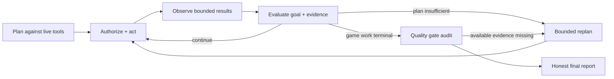
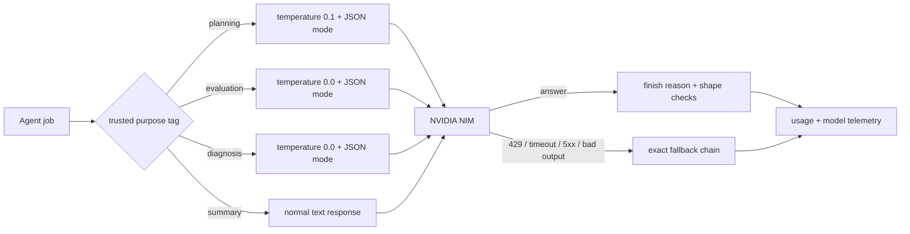

<div align="center">

# NEX // AGENT STUDIO

### A local-first AI operator with a face, a hard MCP boundary, and a refusal to confuse activity with completion.

**PLAN → AUTHORIZE → ACT → OBSERVE → VERIFY → POLISH → PROVE**<br>
<sub>Python standard library · zero frontend build · no hidden computer access</sub>

<br>


<br>

**Not another chatbot with a tool button. A bounded production system that has to show its work.**

</div>

<p align="center">
  
</p>
<p align="center"><sub>
Real tools. Real screens. Real evidence. Photo by
<a href="https://unsplash.com/@jakubzerdzicki?utm_source=nex&utm_medium=referral">Jakub Żerdzicki</a>
on <a href="https://unsplash.com/photos/screens-display-coding-text-representing-programming-work-gCyjEr-g2oI?utm_source=nex&utm_medium=referral">Unsplash</a>.
This is editorial photography, not a Nex screenshot.
</sub></p>

---

## Read this first

Nex has two non-negotiable opinions:

1. **software should feel alive** — the interface is an expressive WebGL face,
   not a spinner taped to a form; and
2. **an agent must earn “done”** — every external action crosses one visible,
   policy-gated MCP boundary, and every ambitious result ends in evidence, not
   celebratory prose.

Connect Unreal, Unity, Godot, Roblox Studio, Blender, an internal engine, or
any other MCP server. Nex discovers the live surface, plans only with tools that
exist, validates a dependency graph, executes approved calls, carries structured
outputs forward, inspects results, repairs bounded failures, and reports exactly
what was proven.

> [!IMPORTANT]
> **“AAA” is a production ambition, not a magic adjective.** Nex can run the
> discipline: inspect, slice, integrate, build, play, capture, review, diagnose,
> verify, profile, and polish. It cannot hallucinate engine features, art
> direction, licensed assets, compute, time, or taste. If the connected MCP
> surface cannot prove the result, Nex does not claim it.

### Jump to the good part

| I want to… | Go here |
| --- | --- |
| launch Nex in under a minute | [Quick start](#quick-start) |
| understand the “make GTA 7” behavior | [The studio program](#from-make-gta-7-to-an-actual-production-program) |
| see why a green tool call is not enough | [Evidence gates](#the-nine-evidence-gates) |
| understand NVIDIA NIM routing | [NIM flight deck](#nvidia-nim-flight-deck) |
| audit the safety boundary | [Security model](#security-model) |
| connect an engine MCP correctly | [MCP server contract](#what-a-capable-game-engine-mcp-server-should-expose) |
| configure everything | [Configuration reference](#configuration-reference) |
| verify the claims | [Tests](#tests) |

### The 20-second architecture

```text
YOU
 │
 ├── talk ──> CHAT BRAIN ─────────────────────────────────────────┐
 │                                                               │
 └── act ───> AGENT BRAIN ─> validated task graph                │
                              │                                  │
                              ▼                                  │
                       policy + approval                          │
                              │                                  │
                              ▼                                  │
                   ONE MCP ACTION BOUNDARY                        │
                              │                                  │
                  ┌───────────┼───────────┐                      │
                  ▼           ▼           ▼                      │
               engine       Blender      your server             │
                  │           │           │                      │
                  └────────── evidence ───┘                      │
                              │                                  │
                              ▼                                  │
                honest result: complete / partial / blocked <────┘
```

| What changes | What never changes |
| --- | --- |
| provider, model, engine, tools, project, goal | MCP is the only action path |
| plan size and production stage | code—not prompt text—owns authority |
| available evidence and quality score | unavailable proof never becomes “passed” |
| NIM/GPT/local provider serving a call | failover never rewrites the build plan |

## Quick start

```bash
git clone https://github.com/Qynl/Nexofficial.git
cd Nexofficial/nex
python3 server.py
```

Open the URL printed in the terminal—normally `http://localhost:8787`. The one-time URL exchanges its token for an `HttpOnly`, `SameSite=Strict` cookie and removes the token from the address bar.

There is no `pip install`, `npm install`, bundler, migration command, or frontend build step. Nex uses:

- Python’s standard library for HTTP, SQLite, concurrency, and transport;
- browser-native WebGL, Web Speech, modules, and CSS;
- local Ollama, NVIDIA NIM, or another OpenAI-compatible model endpoint; and
- MCP servers for **every** real-world action.

Choose a brain—or do nothing and use the local default:

```bash
# Local-only
export OLLAMA_MODEL=gpt-oss:20b

# NVIDIA NIM as the agent brain (chat can remain local)
export NVIDIA_API_KEY=nvapi-your-key
export NEX_AGENT_PROVIDER=nim
export NEX_AGENT_MODEL=nvidia/nemotron-3-super-120b-a12b
```

Then:

1. Open **Settings → Model** and verify the **Model flight plan**.
2. Open **Capabilities → Add server**.
3. Connect an HTTP MCP endpoint or a local stdio MCP command.
4. Review the discovered tools and classifications.
5. Ask Nex to do something.
6. Watch the run card tell the truth in real time.

```text
“Build a polished vertical slice for the abandoned observatory level.
Reuse the project’s existing movement and materials. Add one complete
combat encounter, a readable objective, a restart loop, and a 60 FPS
performance target. Playtest it, inspect the result, fix the highest-impact
problem once, then tell me exactly what remains unverified.”
```

That is the kind of prompt the production protocol is designed to handle—**provided the connected MCP tools can actually inspect, edit, run, capture, verify, and profile the project**.

## What Nex is

| Layer | What it does | What it deliberately does not do |
| --- | --- | --- |
| **Presence** | WebGL face with idle, listening, thinking, speaking, planning, working, and verifying states | Fake activity with decorative progress |
| **Conversation** | Streaming chat, markdown, code blocks, voice, search, regeneration, persistent history | Send provider secrets to the browser |
| **Agent loop** | Plans a DAG, executes ready tasks, records evidence, evaluates, recovers, replans, and summarizes | Treat “the tool returned” as “the goal is complete” |
| **Studio program** | Breaks whole-game/open-world goals into eight separately planned production stages with cross-stage dataflow | Confuse one vertical slice with a finished giant game |
| **Game-production protocol** | Applies capability-aware quality gates and a bounded corrective pass to game-authoring goals | Promise artistic, commercial, or literal AAA quality |
| **MCP boundary** | Discovers and calls operator-connected tools through one manager/policy/audit path | Expose a built-in shell, filesystem, terminal, or arbitrary host tool |
| **Operator controls** | Exact-call approvals, session approvals, server trust, category policy, budgets, cancellation | Let the model grant itself permissions |

## From “make GTA 7” to an actual production program

A city-scale game is not a 16-step task. Nex now recognizes whole-game,
open-world, MMO, sandbox, and similarly large requests and switches from a
single DAG to the hierarchical studio program in `agent/production.py`.

| Stage | Production question |
| --- | --- |
| **1. Discovery & constraints** | What project, engine state, reusable systems, assets, conventions, platforms, and hard constraints actually exist? |
| **2. Production foundation** | What architecture, data model, input/state/save/restart paths, and acceptance contracts can carry the game rather than a demo? |
| **3. Playable vertical slice** | Can one small experience deliver traversal, interaction, challenge, feedback, UI, audio, and recovery at representative quality? |
| **4. Scalable game systems** | Can proven foundations support missions, vehicles, AI, combat, economy, streaming, progression, and their edge cases? |
| **5. World, content & presentation** | Does representative breadth have coherent art direction, lighting, animation, audio, navigation, landmarks, and pacing? |
| **6. Full-loop integration** | Do start-to-finish player journeys survive system boundaries, save/load, failure, UI, controls, and accessibility paths? |
| **7. Validation & optimization** | Do real builds, play sessions, captures, visual reviews, logs, tests, and profiles meet explicit targets? |
| **8. Evidence-driven polish** | Can the highest-impact observed defects be fixed and the affected checks rerun without endless random tweaking? |

Each stage gets a fresh 3–8 step plan against the live catalog. Successful
steps from earlier stages remain in the graph and expose `$step.field` outputs
to later stages; they are not replayed just to recover an ID. New task IDs are
namespaced per milestone, so an eight-stage build cannot collide with its own
history.

Stage completion is machine-audited too. Discovery must contain inspection
evidence; a vertical slice must show implementation, gameplay, presentation,
UI, and an actual play session; systems/world/integration stages require their
relevant production disciplines; validation must independently build, run,
capture, visually review, inspect diagnostics, verify, and profile. Every
milestone also has a minimum number of distinct relevant successful steps, so
one conveniently named “do everything” call cannot certify a whole stage. If an
available requirement was omitted, Nex makes a bounded corrective plan for
that stage. If the capability is unavailable, the program stops partial rather
than advancing on vibes. The run card shows the current stage, evidence gaps,
progress rail, and connected MCP production-readiness score.

Readiness covers both proof capabilities—inspect, build, run, capture, visually
review, diagnose, test, profile—and practical disciplines such as world
authoring, gameplay, AI/navigation, presentation, UI/accessibility, and
save/progression data. Missing implementation, playtest, visual capture, or
visual-review tools are hard readiness blockers. This does not stop useful work;
it stops Nex from calling a thin editor bridge a virtual game studio.

The program remains bounded: 64 tool calls, eight production stages, three
structural replans, one final evidence/polish pass, and a 30-minute wall clock by
default. If any stage cannot be planned or completed, the result is `partial`,
not “GTA finished.” Those limits are configurable for an operator who really
has the engine automation and compute to support a larger campaign.

## The game-production quality protocol

Most “AI made a game” demos stop after files exist. Nex asks a less flattering and much more useful question:

> **What independent evidence do we have that this is a coherent, playable, stable result?**

For game-authoring requests, `agent/quality.py` derives a production contract from the **goal plus the live MCP catalog**. It is engine-agnostic and deterministic. A tool is never invented because a workflow would look nicer with it.

### The nine evidence gates

| Gate | What counts | What does **not** count |
| --- | --- | --- |
| **Inspection** | A successful project/scene/hierarchy/state inspection tool | Assuming the project is empty or follows a familiar template |
| **Implementation** | Successful create/modify/code integration calls | A written plan or generated prose |
| **Build** | A successful compile, build, bake, cook, or package call | “The script was saved” |
| **Playtest** | A real runtime, simulation, PIE, or editor play session | Build success by itself |
| **Visual capture** | A screenshot, captured frame, viewport image, or rendered preview | Inferring appearance from JSON like `{ "ok": true }` |
| **Visual review** | A separate visual-analysis, screenshot-review, comparison, or defect-check tool | Treating possession of a screenshot as evidence that anyone inspected it |
| **Diagnostics** | Runtime logs, console output, errors, warnings, or crash diagnostics reviewed | A process merely starting |
| **Verification** | A verification, validation, automation, functional, integration, or acceptance check | The implementation tool reporting its own success |
| **Performance** | Profiling, frame-time/FPS, memory/GPU stats, telemetry, or benchmark evidence | “It felt fast” without a measurement |

A normal production game-making run requires the first eight. A **flagship** request—terms such as “AAA-style,” “high-quality,” “professional,” “shippable,” or “cinematic”—also requires performance evidence. Visual capture and visual review are deliberately separate: pixels existing is not the same as those pixels being judged.

The final report contains a score from `0–100`, gate-by-gate state, supporting step/tool evidence, missing gates, unavailable capabilities, and the number of corrective passes. A gate can be:

- `passed` — a successful task used a live tool that supports this evidence;
- `not_run` — an appropriate tool existed, but the plan did not use it; or
- `unavailable` — the connected MCP catalog did not expose such a capability.

Structured negative verdicts such as `{"playable": false}`, `{"valid": false}`,
non-empty `errors`, or a failed `status` are rejected as positive evidence even
when transport succeeded.

Unavailable does **not** quietly become passed. If a plan omitted an available gate, Nex can make **one bounded corrective plan** by default. Completed implementation history is preserved, task IDs are safely namespaced, and the corrective prompt explicitly says not to redo successful work. No infinite “just one more polish pass” spiral at 3 a.m.

```json
{
  "tier": "flagship",
  "score": 78,
  "passed": false,
  "missing": ["visual_review", "performance"],
  "unavailable": ["performance"],
  "correctable": ["visual_review"],
  "disclaimer": "This score measures MCP-backed production evidence, not artistic taste, market readiness, or guaranteed AAA quality."
}
```

The UI renders this as a **Production evidence** panel inside the live run card. Green gates are supported by completed calls; amber gates still need work; dim gates are impossible with the current tool surface.

### How a strong game run unfolds

```text
DISCOVER    Read the live MCP catalog; classify what can inspect/edit/run/observe.
    ↓
INSPECT     Understand the existing project, conventions, assets, and constraints.
    ↓
CONTRACT    Turn the request into concrete acceptance criteria.
    ↓
SLICE       Build the smallest coherent playable experience before adding breadth.
    ↓
INTEGRATE   Connect gameplay, content, UI, audio, state, and failure/restart paths.
    ↓
BUILD/RUN   Compile or package where relevant, then enter a real play session.
    ↓
OBSERVE     Capture visuals; inspect logs and diagnostics; profile when available.
    ↓
VERIFY      Check acceptance criteria with evidence independent of implementation.
    ↓
POLISH      Make one bounded, high-impact corrective pass if an available gate was missed.
    ↓
REPORT      Separate implemented, built, played, seen, measured, and still unknown.
```

This ordering matters. A screenshot is not a test. A test is not a play session. A play session is not a profiler. Keeping those claims separate is how Nex becomes more autonomous **without becoming more delusional**.

### What a capable game-engine MCP server should expose

Nex does not require these exact names—the classifier understands common editor vocabulary—but a productive server should offer semantic tools in roughly these families:

```text
inspect_project / inspect_scene / get_hierarchy / actor_details
create_level / add_actor / set_component_property / create_asset
compile_project / build_game / bake_lighting / cook_content
run_game / play_in_editor / start_pie / run_playtest
capture_frame / screenshot_viewport / render_preview
analyze_screenshot / inspect_visual / visual_diff / review_frame
inspect_logs / console_output / get_diagnostics
verify_game / automation_test / functional_test
get_performance_metrics / profiler_capture / benchmark
```

Prefer narrow, schema-rich engine actions over a generic `run_command`. Nex categorically denies shell/process tools anyway. Purpose-built calls produce better plans, safer approvals, stronger audit records, and more honest quality evidence.

## The autonomous loop

One run in `nex/agent/loop.py` is a bounded state machine:



### Planning that cannot wish tools into existence

The planner receives a relevance-ranked view of the live catalog. Large catalogs are filtered to protect context quality, but every proposed tool is validated against the complete registry before it can become a task.

Plans are checked for:

- exact `server.tool` existence on a connected server;
- policy denial;
- live JSON input-schema requirements;
- object-shaped arguments;
- recursively valid `$step` and `$step.field` references tied to declared dependencies;
- duplicate names, missing dependencies, and cycles; and
- bounded plan size.

A qualified name is exact. `evil.echo` is never silently shortened to `echo`. A dangling dependency is not ignored. A cyclic graph does not execute. If the model returns nonsense, the deterministic fallback handles only simple requests that clearly map to a live tool; otherwise Nex reports `blocked` instead of improvising fictional capabilities.

### Dataflow between steps

Later steps can consume prior MCP results:

```json
{
  "name": "verify-build",
  "tool": "engine.verify_game",
  "args": { "build": "$package-game.id" },
  "depends_on": ["package-game"]
}
```

References resolve recursively inside nested objects and arrays, but only after an explicitly declared dependency succeeds. Hidden ordering by list position is refused. If `id` is absent, a reference is malformed, nesting is hostile, or `depends_on` is missing, the step fails before transport. Nex never sends a raw string such as `$package-game.id` and hopes the server understands the accident.

### Recovery without thrashing

A failed call moves through a fixed ladder:

1. retry a transient transport failure;
2. apply a deterministic schema-informed argument fix when possible;
3. ask one tightly scoped model diagnosis to repair arguments or select a real alternative tool;
4. stop and report the failure honestly.

Retries, replans, steps, quality passes, approval waits, and wall time all have budgets. Cancellation works while a run is active. Dependency failure marks downstream steps skipped rather than replaying the whole project.

### Completion has semantics

- `completed` — executable work succeeded **and**, for game production, every required evidence gate passed;
- `partial` — useful work landed, but a task failed, plan validation dropped a proposed step, a stage remains incomplete, or production evidence is missing;
- `failed` — the goal could not be reached;
- `blocked` — no executable plan/capability exists or policy prevented action; and
- `cancelled` — the operator stopped the run.

An MCP JSON-RPC response with `result.isError=true` is a failure. A successful transport envelope is not proof that the underlying tool succeeded.

## The one action path

Nex has no secret second toolbox.

```text
Browser
  │  authenticated REST + Server-Sent Events
  ▼
server.py
  │
  ▼
agent/loop.py
  │  plan and evidence only
  ▼
mcp/manager.call()             ← every external action enters here
  │
  ├─ live schema validation
  ├─ server trust check
  ├─ capability classification
  ├─ argument/content scan
  ├─ authorization / exact approval
  ├─ privacy-preserving audit
  ▼
mcp/transport.py
  ├─ HTTP JSON-RPC
  └─ stdio JSON-RPC             ← the only subprocess-spawning module
        │
        ▼
Operator-connected MCP server
```

The capability registry is metadata-only. It can describe tools; it cannot call them. The quality protocol classifies evidence; it cannot call tools. The planner proposes; it cannot call tools. Only the manager can cross the boundary.

## Security model

The safety story is not “the prompt told the model to behave.” Prompts improve judgment; code owns authority.

### 1. MCP-only is structural

`MCP_ONLY = True` is hardcoded. Nex exposes no model-visible local filesystem, shell, terminal, process, host, or arbitrary network helper. There is no environment flag that turns those on.

Even if an MCP server advertises `run_command`, `spawn_shell`, `open_terminal`, `powershell`, `subprocess`, or equivalent normalized/tokenized forms, policy refuses the tool categorically.

### 2. Connected is not trusted

Adding a server permits discovery. UI-added servers begin untrusted. Trust and standing approvals are operator actions, never model actions.

| Capability | Default posture |
| --- | --- |
| Read / create / modify / build / test on a trusted server | Allowed after schema and content checks |
| Unknown classification | Confirmation required |
| Network action | Confirmation required |
| Destructive action | Confirmation required |
| Engine/language code execution | Specific confirmation or explicit server/tool standing approval |
| Generic shell/process execution | Always denied |
| Untrusted server in unattended mode | Refused |
| Any call containing an escape payload or secret | Always denied; never offered for approval |

MCP annotations such as `readOnlyHint` are untrusted metadata from the server. They can raise caution but cannot downgrade Nex’s own name-based classification.

### 3. The call payload is inspected too

A friendly tool name is not enough. Nex recursively scans bounded string arguments and rejects:

- OS/process primitives in code payloads (`subprocess`, `os.execute`, `io.popen`, `loadstring`, shell invocations, and related forms);
- sensitive locations (`~/.ssh`, `.aws`, `.gnupg`, `/etc`, `/proc`, `/sys`, system profiles, and Nex’s own state/token);
- path traversal in path-like fields;
- credential shapes including API keys, AWS IDs, JWTs, private keys, bearer credentials, and long secret assignments;
- oversized, cyclic, or excessively deep structures that cannot be completely inspected.

Unicode is normalized and common URL encoding is decoded before checks. Refusal happens before confirmation, so “approve” cannot legalize an escape payload.

### 4. Approvals bind to the exact call

**Approve once** is bound to the server, tool, and canonical argument digest, then consumed. Changing one argument invalidates it. The approval UI shows the complete bounded payload. **Allow for this session** is a separate deliberate action.

### 5. MCP contracts are enforced in both directions

Arguments are checked against the discovered MCP `inputSchema`: required fields, types, unknown properties when disallowed, nesting depth, collection size, string length, and total payload bounds. Invalid calls never reach the server.

When a tool declares an MCP `outputSchema`, Nex exposes its return fields to the planner so later steps can use real `$step.field` dataflow instead of guessing IDs. A successful response must then include matching `structuredContent`; missing or wrong-typed output becomes `invalid_output`, is audited as failure, and cannot count as production evidence. The Capabilities UI shows both **Input** and **Returns (validated)** contracts.

### 6. Transports assume hostile input

HTTP and stdio JSON-RPC implementations enforce framing and response limits, validate IDs/envelopes, bound paginated discovery, and reject malformed session IDs. HTTP redirects remain same-origin. URL credentials plus metadata/link-local SSRF targets are rejected. Broken stdio process groups are recycled after timeout/framing failure so a late response cannot poison the next request.

Stdio commands are parsed without a shell, must begin with a single executable token, can be pinned with `NEX_STDIO_ALLOW`, and receive a minimal environment. Provider keys and Nex’s auth token are not inherited.

### 7. The browser is authenticated and hardened

- generated server token stored `0600` under `~/.nex`;
- token exchanged for an `HttpOnly`, `SameSite=Strict` cookie;
- mutation requests require the `X-Nex: 1` anti-CSRF header;
- query-string credentials are not accepted by APIs;
- Content Security Policy, anti-framing, no-referrer, and MIME-sniffing protections;
- sanitized markdown rendering with no raw HTML injection; and
- bounded request bodies, safe handling of malformed/chunked input, connection timeouts, and bodyless `HEAD` responses.

### 8. Audit without secret hoarding

Every attempted action records server, tool, decision, outcome, duration, run/step context, and argument **names/types**. Raw string values are deliberately excluded, so the log is useful without becoming a second secrets database.

## Interface

Nex is intentionally one coherent application rather than a settings dashboard wearing a chat box.

### The face

A single WebGL canvas draws a soft, reactive face from signed-distance-field rounded rectangles—no image sprites. It moves between a large empty-state pose and a compact top-bar pose. Listening follows real microphone amplitude, speaking follows browser speech, and work states follow the actual SSE pipeline.

### Run cards

Every autonomous run appears inline with:

- goal and current phase;
- full step list with dependencies and status;
- tool name, bounded result preview, retry state, and timing;
- exact approval controls;
- final outcome; and
- game-production evidence scorecard when applicable.

This is execution state, not exposed chain-of-thought. Nex shows what it is doing without pretending private model scratchpads are observability.

### Capabilities

The Capabilities view connects/disconnects/reconnects/removes servers, exposes live health and latency, lists discovered input/output contracts, shows classification, and makes server trust explicit. It also calculates **Game-production MCP readiness** before a run, with chips for every evidence gate and production discipline plus explicit hard blockers.

### Conversation

Streaming markdown, fenced code, copy/listen/regenerate/edit-and-resend actions, search, automatic titles, SQLite persistence, and browser-native speech all run without a frontend framework.

### Model flight plan

Settings → Model is an operations panel rather than three disconnected API-key
forms. It edits Chat and Agent primaries, exact role models, ordered fallbacks,
provider defaults, local RPM ceilings, and structured-output support. Live cards
show the provider/model that really answered, last agent job, calls, tokens, and
headroom. Dynamic provider/model text is inserted as text—not executable HTML.

## Model providers

Nex separates **conversation** from **operation**:

| Role | What it does | Typical call shape |
| --- | --- | --- |
| **Chat brain** | talks with the operator and decides whether a request should become an autonomous run | streaming, expressive, low frequency |
| **Agent brain** | plans, evaluates, diagnoses, replans, and writes the evidence report | non-streaming, structured, repeated |

Each role owns an explicit primary provider, exact model, and ordered fallback
chain. Local Ollama, NVIDIA NIM, OpenAI, and custom OpenAI-compatible endpoints
can be mixed. The **Model flight plan** in Settings shows both routes, the model
actually serving now, recent job purpose, token counts, success counts, and
remaining local RPM headroom.

A model produces text. It never receives an OS handle, shell, filesystem, or
MCP transport. Provider failover can change the brain serving a request; it
cannot bypass policy or invent another action path.

## NVIDIA NIM flight deck

NIM is not treated as “some URL that probably speaks OpenAI.” Nex gives it an
operational contract designed for long autonomous runs.



### What Nex now does for NIM

**1. It sends the model you selected.**  The role-level model override is the
model placed in the real request body—not merely a label in Settings. If NIM
falls back to GPT or Ollama, that provider receives its own model ID. A NIM
model name is never accidentally sent to a different backend.

**2. It identifies the job without reading tea leaves.**  The agent loop passes
trusted purpose tags: `planning`, `evaluation`, `diagnosis`, and `summary`.
Those tags come from code, not user prompt text. They drive deterministic
sampling and appear in the flight telemetry.

**3. It asks for machine output as machine output.**  NIM and GPT default to
OpenAI-compatible `response_format: {"type":"json_object"}` for plans,
evaluations, diagnoses, and batches. The returned JSON is still parsed and
validated locally; JSON mode improves syntax, not authority. It can be disabled
per provider for an older or incompatible endpoint.

**4. It refuses truncated “success.”**  A completion ending with
`finish_reason=length`, content filtering, or another incomplete reason is a
bad response. A half-plan cannot become half of an executable graph. Nex parks
that attempt and continues through the configured fallback chain.

**5. It never promotes hidden reasoning to an answer.**  If a reasoning model
returns `reasoning`/`reasoning_content` but no final `content`, Nex reports a bad
response. Private scratch text is neither a plan nor evidence.

**6. It accounts for the flight.**  Provider state records request counts,
success/failure counts, the actual response model, job purpose, finish reason,
and aggregate prompt/completion token counts. It stores none of the prompt or
answer text in telemetry.

**7. It protects scarce calls before a 429.**  `NEX_NIM_RPM=40` is Nex’s
configurable local safety ceiling—not a promise about NVIDIA’s quota. A sliding
60-second window, minimum spacing, and a 25% headroom reserve keep an agent run
from spending every available request. Hosted NIM limits can vary by account,
model, endpoint, and load.

**8. It obeys real recovery signals.**  `Retry-After` works as either seconds or
an HTTP date. A full local window waits briefly when useful, otherwise hands the
same messages to the next provider. When cooldown expires, NIM automatically
returns to service. Authentication failures stay parked until configuration
changes instead of hammering a rejected key.

**9. It fails over the hands—not the plan.**  The exact message list is handed
to the next provider. Completed MCP actions are not replayed, task IDs are not
regenerated, and the UI emits `provider.fallback` / `provider.recovered` events
so the operator can see the handoff.

**10. It treats the endpoint as a credential boundary.**  Keys remain on the
server, are stored `0600`, and are bound to the host for which they were entered.
Changing the base URL makes the key go dark until it is re-entered. Redirects
may not cross hosts. Metadata/link-local targets, URL credentials, oversized
responses, oversized stream lines, and unbounded streams are rejected.

NVIDIA documents hosted and self-hosted NIM chat through the OpenAI-compatible
`/v1/chat/completions` endpoint and supports model discovery at `/v1/models`.
Structured-output support is model/runtime dependent, which is why Nex exposes
the toggle and still validates every result. See NVIDIA’s
[LLM API reference](https://docs.nvidia.com/nim/large-language-models/2.0.3/reference/api-reference.html),
[structured JSON guidance](https://docs.nvidia.com/nim/large-language-models/2.0.10/get-started/advanced/get-started-nemotron-3.5-lightning.html),
and the live [NVIDIA API Catalog](https://build.nvidia.com/explore/discover).
The live model list in Settings is authoritative; the curated list is only a
starting point because catalog availability changes.

### Recommended routes

#### Private workstation

```dotenv
NEX_CHAT_PROVIDER=local
NEX_CHAT_MODEL=gpt-oss:20b
NEX_AGENT_PROVIDER=local
NEX_AGENT_MODEL=gpt-oss:20b
```

#### Local chat + NIM production agent

```dotenv
NVIDIA_API_KEY=nvapi-your-key
NEX_CHAT_PROVIDER=local
NEX_CHAT_MODEL=gpt-oss:20b
NEX_AGENT_PROVIDER=nim
NEX_AGENT_MODEL=nvidia/nemotron-3-super-120b-a12b
NEX_AGENT_FALLBACKS=local
NEX_NIM_RPM=40
```

#### Cloud planning + NIM agent + local last resort

```dotenv
OPENAI_API_KEY=your-openai-key
NVIDIA_API_KEY=nvapi-your-key
NEX_CHAT_PROVIDER=gpt
NEX_CHAT_FALLBACKS=nim,local
NEX_AGENT_PROVIDER=nim
NEX_AGENT_FALLBACKS=gpt,local
```

Copy the complete example if you prefer configuration as code:

```bash
cp nex/.env.example nex/.env
```

```dotenv
# Example HTTP and stdio MCP servers
NEX_SERVERS=engine=http://127.0.0.1:9876/mcp,assets:uvx my-asset-mcp
```

> [!TIP]
> Start with the default Nemotron Super route for stronger planning. Try
> `nvidia/nemotron-3.5-lightning-30b-a3b` when low latency and sustained agent
> throughput matter more. Always press **list** in Settings first: a model ID
> that exists in a README is not proof that your endpoint currently serves it.

## Configuration reference

All settings are optional unless your chosen model provider requires a key.

| Variable | Default | Purpose |
| --- | ---: | --- |
| `OLLAMA_HOST` | `http://127.0.0.1:11434` | Local Ollama endpoint |
| `OLLAMA_MODEL` | provider default | Local model |
| `NEX_CHAT_PROVIDER` / `NEX_AGENT_PROVIDER` | `local` | Primary provider per role |
| `NEX_CHAT_MODEL` / `NEX_AGENT_MODEL` | provider default | Model per role |
| `NEX_CHAT_FALLBACKS` / `NEX_AGENT_FALLBACKS` | configured chain | Comma-separated role failovers |
| `NVIDIA_API_KEY` | empty | NVIDIA NIM credential |
| `OPENAI_API_KEY` | empty | OpenAI-compatible credential |
| `NEX_PROVIDER_HOSTS` | empty | Optional strict exact-host allowlist for model endpoints |
| `NEX_SERVERS` | empty | Startup MCP server definitions |
| `NEX_HTTP_ALLOW` | loopback only | Pre-approved remote MCP hosts |
| `NEX_STDIO_ALLOW` | any reviewed command | Pin allowed stdio executables |
| `NEX_STDIO_ENV_ALLOW` | empty | Explicit extra environment names delegated to stdio servers |
| `NEX_TRUSTED_SERVERS` | empty | Servers permitted for autonomous operation |
| `NEX_ALLOW_CODE_EXECUTION` | empty | Servers explicitly approved for engine/language code tools |
| `NEX_ALLOW_CONFIRMATIONS` | empty | Servers pre-approved for non-code confirmation categories |
| `NEX_CAPABILITY_FILE` | `~/.nex/capabilities.json` | Operator classification pins; escalation only |
| `NEX_MAX_STEPS` | `64` | Maximum executed tool steps per run |
| `NEX_MAX_REPLANS` | `3` | Maximum structural replans |
| `NEX_MAX_QUALITY_PASSES` | `1` | Maximum final evidence/polish passes after game work |
| `NEX_MAX_PRODUCTION_STAGES` | `8` | Milestone-plan cap for studio-scale game goals |
| `NEX_RUN_BUDGET_S` | `1800` | Run wall-clock budget |
| `NEX_APPROVAL_TIMEOUT_S` | `600` | Approval wait budget |
| `NEX_HOST` / `NEX_PORT` | `0.0.0.0` / `8787` | HTTP bind address |
| `NEX_HOME` | `~/.nex` | Persistent state directory |
| `NEX_AUTH_TOKEN` | generated | Fixed token override; minimum 32 characters |
| `NEX_COOKIE_SECURE` | false | Secure cookie for HTTPS deployments |

See [`nex/.env.example`](nex/.env.example) for comments and examples.

## Tests

```bash
cd nex
python3 tests/run_all.py
```

Eleven suites run in isolated processes because several intentionally configure different state homes and policies:

| Suite | What it proves |
| --- | --- |
| `test_architecture` | Dependency direction; metadata-only registry; no local tool surface; subprocess use confined to MCP stdio transport; immutable MCP-only boundary |
| `test_capability` | Severity-max classification, editor vocabulary, code-execution distinctions, confirmation gates |
| `test_transport` | NDJSON/LSP framing, fragmented reads, limits, process lifecycle, HTTP round-trips, hostile responses |
| `test_manager` | Server lifecycle, trust, input/output contract validation, policy path, approvals, audit, persistence |
| `test_agent_loop` | Planning, DAG validation, references, retries, argument repair, replanning, budgets, cancellation, reports |
| `test_quality` | Game intent detection, separate capture/review gates, evidence-only scoring, unavailable gates, bounded corrective polish |
| `test_production` | Large-scope detection, MCP studio readiness, eight-stage execution, cross-stage dataflow, bounded honest completion |
| `test_store` | Conversations, messages, search, regeneration truncation, durable SQLite state |
| `test_server_api` | Authentication, CSRF, login, static serving, traversal defenses, chat, SSE, real HTTP MCP integration |
| `test_escape` | Malicious tools/results/config, prompt injection, sensitive payloads, approval replay, no second action route |
| `test_providers` | Exact role-model dispatch, NIM JSON mode, purpose temperatures, usage telemetry, truncation rejection, failover, pacing, and key/host binding |

Useful development checks:

```bash
python3 -m compileall -q nex
for f in nex/web/js/*.js; do node --check "$f"; done
git diff --check
```

The most important suite is not the happiest one. `test_escape.py` actively tries to turn model output and malicious MCP data into host access. `test_architecture.py` makes sure a future refactor does not quietly create a second action path.

## Repository map

```text
Nexofficial/
├── README.md
├── docs/assets/                    README photography
└── nex/
    ├── server.py                   stdlib HTTP, auth, REST, SSE, composition root
    ├── store.py                    SQLite conversations and messages
    ├── .env.example                providers, MCP, policy, budgets, server
    ├── agent/
    │   ├── loop.py                 plan → act → observe → evaluate → adapt
    │   ├── production.py           eight-stage studio program + MCP readiness
    │   ├── quality.py              production contracts, gates, scorecards
    │   ├── model_planner.py        model plan + deterministic live validation
    │   ├── planner.py              conservative no-model fallback
    │   ├── task_graph.py           dependencies, state, failure propagation
    │   ├── context.py              bounded observations and failures
    │   ├── diagnose.py             one-shot failure repair decisions
    │   ├── llm.py                  trusted purpose tags for provider calls
    │   ├── prompts.py              scoped model roles and hard boundary language
    │   ├── providers.py            NIM JSON mode, exact models, pacing, telemetry, fallback
    │   ├── events.py               public execution-state vocabulary
    │   ├── jsonreply.py            bounded JSON extraction
    │   └── mock_mcp.py             deterministic in-process MCP for tests
    ├── mcp/
    │   ├── manager.py              lifecycle and the only action entry point
    │   ├── policy.py               authorization + payload escape scanning
    │   ├── capability.py           severity-max tool classification
    │   ├── schema.py               bounded JSON-schema argument validation
    │   ├── registry.py             metadata-only live capability view
    │   ├── transport.py            hardened HTTP + stdio JSON-RPC
    │   └── audit.py                privacy-preserving action records
    ├── web/
    │   ├── index.html              accessible application shell
    │   ├── css/app.css             complete visual system
    │   └── js/                     face, chat, runs, capabilities, settings
    └── tests/                       eleven isolated suites + HTTP echo MCP
```

## Honest limits

Good boundaries are also honest about what sits outside them.

- **Nex orchestrates capabilities; it does not contain an engine.** If the MCP server cannot manipulate navmeshes, animate characters, capture a viewport, or profile a build, Nex cannot synthesize those powers.
- **The quality score is evidence coverage, not a review score.** `100/100` means all required tool-backed checks ran successfully. It does not mean the art is beautiful, the combat is fun, the story is good, accessibility is complete, or customers will buy it.
- **Autonomous is not the same as unattended.** Risky tools still wait for a person unless the operator explicitly grants a standing approval.
- **MCP servers are third-party code.** Nex controls what it sends and how it interprets responses, but a malicious server can lie about what happened. Keep servers untrusted until reviewed. A local stdio server still runs with the OS permissions of the user who launched Nex; the minimal environment prevents accidental token inheritance, not all OS-level access.
- **The deterministic planner is intentionally modest.** Without an agent model, it handles direct lexical tool requests and blocks ambiguous production work. Confidence theater was not invited to this party.
- **Voice quality belongs to the browser.** Unsupported Speech APIs simply hide voice controls.
- **Human creative direction still matters.** The best use of Nex is not “replace a studio.” It is “give a skilled creator a tireless, observable operator that knows when to keep working and when the evidence runs out.”

## Operating philosophy

> **Give the model judgment. Give code authority. Give the user evidence.**

Nex is trying to make autonomous work feel less like watching a slot machine and more like working with a careful technical producer: ambitious about the outcome, annoyingly specific about the proof, and incapable of sneaking off to a shell when nobody is looking.

---

<div align="center">

**The face is the interface. The boundary is the product. The evidence is the finish line.**

</div>
