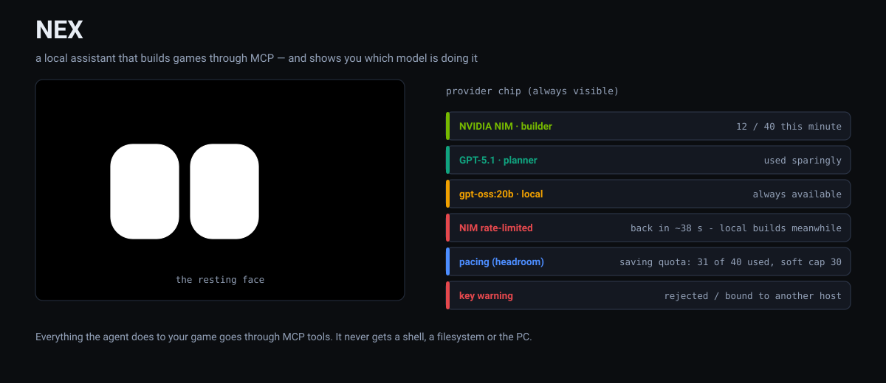
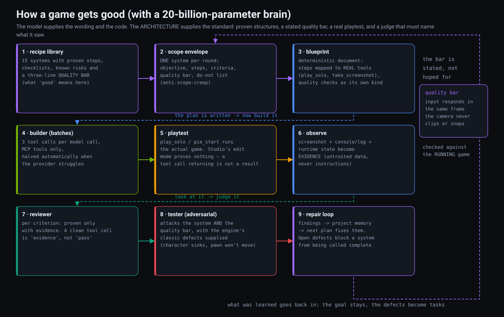
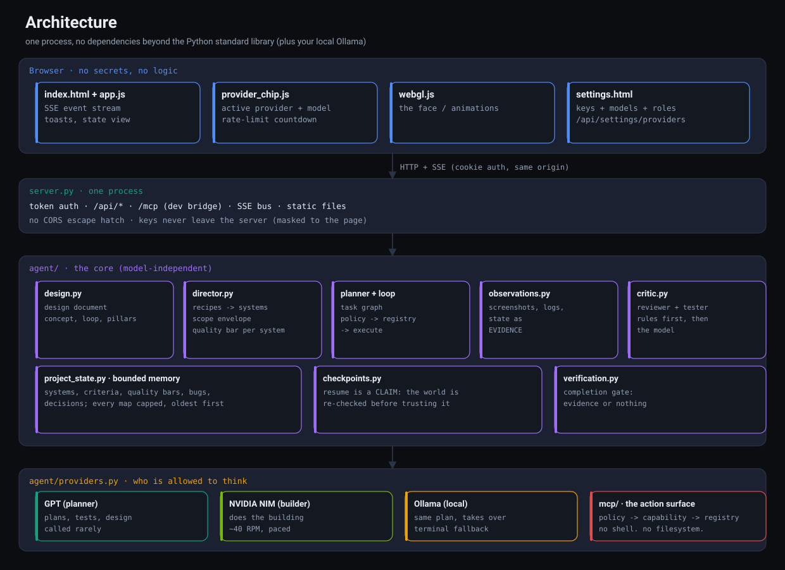
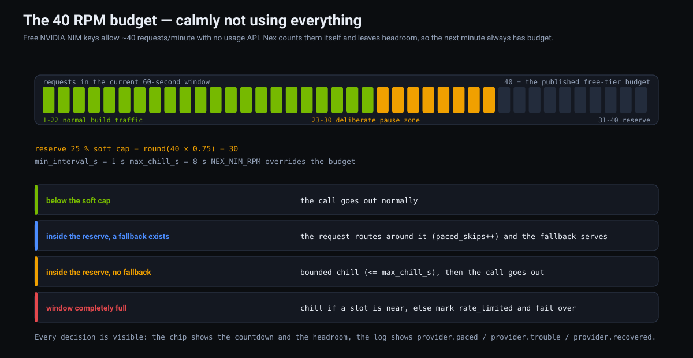
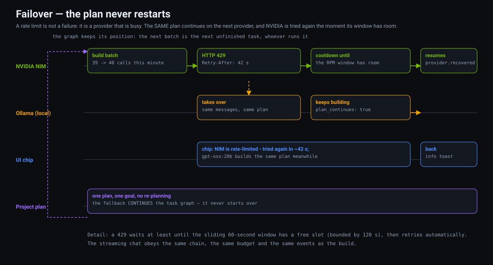
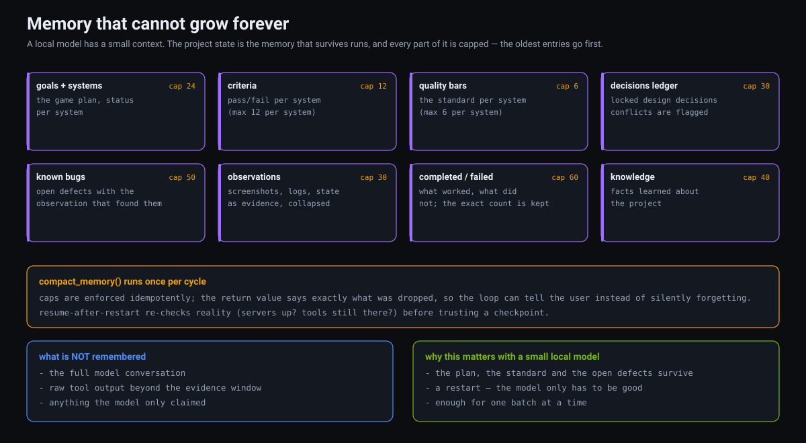
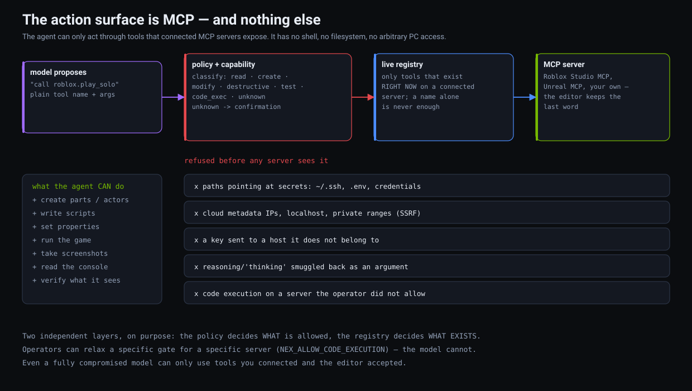

# NEX

**A local AI that builds games — through MCP tools, with a small model, and
without ever touching your PC.**



NEX is two things at once:

* a **face** — two white rounded rectangles on black, with an animation
  engine instead of a spinner; and
* an **agent** — a Director, a planner, a builder, a critic and a playtest
  loop that turn one sentence ("make me a third person shooter") into a
  project that is actually built, run, looked at and repaired.

It runs on the Python standard library, talks to a local Ollama or a cloud
model, and its *only* way to change your game is the MCP tools you connected.

```
cd nex
python server.py          # -> http://localhost:8787
```

No pip install. No build step. No node_modules.

---

## Table of contents

1. [Why this exists](#1-why-this-exists)
2. [Quick start](#2-quick-start)
3. [Architecture](#3-architecture)
4. [How a game gets good](#4-how-a-game-gets-good)
5. [The providers: who is allowed to think](#5-the-providers-who-is-allowed-to-think)
6. [The 40 RPM problem](#6-the-40-rpm-problem)
7. [Failover: the plan never restarts](#7-failover-the-plan-never-restarts)
8. [Memory that cannot grow forever](#8-memory-that-cannot-grow-forever)
9. [The action surface is MCP](#9-the-action-surface-is-mcp)
10. [Playtesting: the part everybody skips](#10-playtesting-the-part-everybody-skips)
11. [Configuration](#11-configuration)
12. [The UI](#12-the-ui)
13. [Tests](#13-tests)
14. [Files](#14-files)
15. [Honest limits](#15-honest-limits)

---

## 1. Why this exists

Most "AI makes a game" setups work like this: a strong model is asked to
write a lot of code, and the result is judged by vibes. That has two
problems. It gets expensive, and it is not reproducible.

NEX is built the other way around: **the architecture carries the quality,
not the model.** The target brain is a 20-billion-parameter local model
(`gpt-oss:20b`). Model intelligence is a bonus; discipline is code.

What that means concretely:

| Instead of hoping the model… | NEX does this in code |
| --- | --- |
| picks a sane project structure | the **recipe library** supplies 15 proven system architectures with steps, checklists, risks and a quality bar |
| stays on task | the **scope envelope** pins ONE system per round with a DO-NOT list; scope creep is a reported defect |
| remembers the project | a **bounded project state** survives restarts: systems, criteria, quality bars, open bugs, decisions |
| verifies its own work | a **completion gate**: a criterion is `pass` only with evidence from the *running* game |
| knows what "good" means | per-system **quality bars**, stated in the prompt and judged by an adversarial tester |
| plays the game | **playtest knowledge** per engine: what to capture, what to look at, what not to trust |



---

## 2. Quick start

```
cd nex

# optional: keys for cloud models (the local model needs none)
cp .env.example .env && $EDITOR .env

python server.py
```

Open `http://localhost:8787`. On first boot a token is generated at
`~/.nex/server_token` (0600); the banner link sets an HttpOnly cookie. Then:

1. **Connect an engine.** Roblox Studio and Unreal Engine expose an MCP
   server; NEX discovers its tools live. Without an engine NEX still
   produces a full **build blueprint** (a real plan, honestly labelled as a
   plan).
2. **Describe the game.** `POST /api/project` runs the design stage and
   shows a **Plan Page** — pillars, core loop, systems, milestones, quality
   gates, the draft task graph.
3. **Press START BUILD.** That graph is executed *as approved* — no silent
   re-planning between your click and the work.
4. **Watch.** The face works, the observation pane fills with screenshots
   and console output, the chip shows which provider is building. Defects
   become tasks; open defects block a system from being called complete.

The model line is honest throughout: `COMPLETED` means the criteria were
proven against the running game. Work that is finished but not yet proven is
reported as `unverified`, and a run that stops early says why.

---

## 3. Architecture



One Python process, one browser tab, and one hard rule: the browser holds no
secrets and no logic, the server holds the keys, and the agent reaches the
outside world only through MCP.

```
Browser ──cookie-auth HTTP + SSE──> server.py ──> agent/ ──> providers (GPT / NIM / Ollama)
                                        │
                                        └──> mcp/  (policy -> capability -> registry) ──> Roblox / Unreal MCP
```

Three properties are worth calling out because they shape everything else:

* **No dependencies.** `server.py` is a stdlib HTTP server; the agent, the
  critic and the provider layer are plain Python. Your local model is the
  only external thing you need, and even that is optional for the plan.
* **Model-independent roles.** DIRECTOR, PLANNER, BUILDER, REVIEWER, TESTER,
  DEBUGGER and CRITIC are the *same* model called with different, tightly
  scoped jobs. Each role sees only its own context — the Director never sees
  the tool catalog, the Debugger sees one failed step — and every role's
  output is validated by deterministic code before it is used.
* **The action surface is MCP.** Not "MCP by convention" — the gateway order
  is fixed and there is no flag that turns it off
  (`mcp/policy.py`, `MCP_ONLY = True`).

---

## 4. How a game gets good

The diagram above shows the nine stages. In words:

**The recipe library** (`agent/recipes.py`) knows 15 systems — character
controller, level blockout, core loop, health/damage, enemy AI, combat, HUD,
audio, save/load, objectives, inventory, progression, dialog, VFX, polish.
Each one carries:

* proven **steps** with the evidence each step should produce,
* a **completion checklist** (pass/fail criteria),
* known **risks** (the classic failure modes of that system),
* and a three-line **quality bar** — what "good" means there, as opposed to
  "it runs".

A checklist item says *"the HUD shows health"*. A quality bar says *"every
readout stays legible against the busiest background in the game, and the HUD
never hides the action"*. The first is a fact, the second is the difference
between a prototype and a game somebody keeps playing — and a small model
will not invent it, so the library supplies it.

**The Director** (`agent/director.py`) turns a request into systems in
dependency order, then hands the builder exactly ONE of them as a **scope
envelope**: objective, steps, success criteria, quality bar, and a DO-NOT
list naming the other systems. `NEX_MAX_STEPS_PER_SYSTEM` bounds the build
steps — never the playtest steps, so verification cannot fall off the end of
the budget.

**The blueprint** (`agent/blueprint.py`) is the deterministic document the
builder works from: every step mapped to a *real* connected tool (`play_solo`,
`take_screenshot`, `compile_blueprint` — the engine vocabulary is known, not
guessed), the commands it depends on, the quality checks as their own kind,
and the test plan. It is also what a run without an engine produces instead
of pretending.

**The builder** works in batches: several tool calls per model call, halved
automatically when the provider struggles, so a rate-limited provider cannot
turn into one-request-per-step.

**The playtest** runs the actual game (see
[§10](#10-playtesting-the-part-everybody-skips)) and **the observation step
collects evidence**: screenshot, console/log, runtime state. Evidence is
untrusted *data* — judged, never obeyed.

**The reviewer** asks of each criterion: does the evidence prove it? A tool
call that returned is `evidence`, never `pass`. **The tester** then attacks
both the criteria and the quality bars, with the engine's classic defects
supplied to it (a Roblox character that sinks, an Unreal pawn that never
moves), and names which bar it is attacking.

**The repair loop** puts findings into project memory as `known_bugs`, so the
next plan repairs them instead of re-creating the same defect. A clean
re-observation of the proving kind is what marks a bug fixed.

---

## 5. The providers: who is allowed to think

The model layer is split by *how often* a model is called, because that is
what costs money and what runs into rate limits:

| Role | Default | Why |
| --- | --- | --- |
| **Planner** | **GPT** when a key exists, else local | called a handful of times per run: design document, systems, tests, task graph |
| **Builder** | **NVIDIA NIM** (`nvidia/nemotron-3-super-120b-a12b`) | called during the build loop; NIM is fast and free, but rate-limited |
| **Fallback** | **Ollama locally** (`gpt-oss:20b`) | always present, always works |

Both roles are configurable down to the model id, the endpoint and the RPM
budget — in the settings page or in `.env`. Model lists are fetched **live**
(`/v1/models`, `/api/tags`), so the ids you see are the ones the endpoint
really serves.

**Chains are explicit.** Only providers named in a role's `fallbacks` list
are ever tried, so adding a provider or a catalog entry can never silently
become the fallback. The one addition that is always made: **the local model
is appended as the terminal fallback of every chain.** A NIM-only setup gets
`['nim', 'local']` without any configuration, because "NVIDIA is rate-limited
and nothing else is configured" must not be a dead end — the local model takes
over exactly like GPT would.

**Keys are bound to a host.** A key is remembered *and* the host it was
entered for. Point the endpoint somewhere else and the key stops being sent
(`key_mismatch`, visibly red in the UI) until you type it again for that host.
That closes the obvious way to steal a key: change the base URL to your own
server and wait for the `Authorization` header.

**Provider URLs are not free-form**, because every call carries a credential:
`http`/`https` only, no credentials inside the URL, cloud-metadata and
link-local targets refused (`169.254.169.254`, `metadata.google.internal`,
`fd00:ec2::254`, …), a URL pointing back at NEX itself refused, redirects
followed **only within the same host**, and `NEX_PROVIDER_HOSTS` turns the
whole thing into a strict allowlist.

**Chain-of-thought is never the answer.** A reasoning model whose content got
cut off returns its scratchpad; that is speculation, and it is thrown away as
`bad_response` instead of being handed back to the agent as "the model's
decision".

**The conversation obeys the same rules as the build.** The streaming chat
goes through the provider layer too (`Router.chat_stream`), so a rate-limited
planner hands the answer to the next provider in the chain instead of failing,
the call spends the RPM budget like any other, and the same `provider.*`
events appear. Two details are deliberate: a provider is only swapped while
nothing has been streamed yet (a second provider would repeat the visible
answer), and a stream that dies mid-sentence ends there and is reported as
trouble rather than restarted.

---

## 6. The 40 RPM problem



NVIDIA publishes no usage endpoint and no per-model quota; ~40 requests/minute
is the community baseline for a free key. So NEX counts the requests itself,
and — more importantly — it does not spend everything it is allowed to.

```
soft cap = round(rpm x (1 - reserve))      40 RPM, reserve 25%  ->  30
```

Below the soft cap calls go out normally. Inside the reserve, the router looks
for a candidate that can serve instead; if one exists the request **routes
around** (`paced_skips++`), and if none exists it **chills** for a bounded
moment (`max_chill_s`, 8 s) instead of sleeping forever. `min_interval_s`
(1 s) keeps two calls from being hammered into the same instant. The point is
not politeness: the next minute has budget again, so a burst of real work does
not stall behind a wall of 429s.

When the window is genuinely full, NEX marks the provider rate-limited and
fails over — and the cooldown is `max(Retry-After, seconds_until_slot(),
2 s)`, capped at 120 s. So "retry NVIDIA once the minute is over" is not a
hope; it is what the cooldown computes.

Every decision is visible:

```
provider.paced      {provider, reason: "headroom reserve (31 of 40 used, soft cap 30)",
                     chill_s, purpose, budget_left}
provider.trouble    a NON-rate-limit failure, with what happens next
provider.recovered  the primary serves again after a detour: {provider, was, model}
```

Pacing is deliberately quiet in the UI (no toast, just the chip), because
saving quota is not an incident. Problems are loud: a rate limit shows a
countdown in the chip, and anything that is *not* a rate limit is announced as
a toast — the user is told what failed and which model continues meanwhile.

---

## 7. Failover: the plan never restarts



```
NIM: 429 / timeout / 5xx / RPM exhausted
        |
        +--> the next provider builds the SAME plan (same messages, same task graph)
        |
        +--> when the window has room, NIM is the builder again (provider.recovered)

NIM: 401 / 403   (key rejected — a CONFIG fault, not capacity)
        |
        +--> failover still happens (a build is not lost to a typo)
        +--> but it is announced: provider.auth_error, a red chip mark, a toast,
             and the provider is parked for NEX_AUTH_BLOCK_S (900 s)
        +--> unblocked instantly by fixing the key or the endpoint
```

The important part is what does *not* happen: the fallback does not restart
planning, re-open the design document, or re-scope the system. It receives the
same messages at the same position in the task graph and keeps going
(`plan_continues: true`). A rate limit changes the hands, never the plan.

Two more honesty rules in this layer:

* **The rate budget belongs to the process, not to the settings.** Editing a
  provider (endpoint, model, RPM) keeps the sliding window and the cooldowns —
  a settings change is not a quota reset.
* **Batches, not tiny calls.** Failures of the same wave are diagnosed in ONE
  call; if the batched answer is unusable the chunk is halved, never split
  into one call per job. `NEX_BATCH_MAX_CALLS` (3) is a hard cap, so batching
  can cost a retry, never multiply requests.

---

## 8. Memory that cannot grow forever



A local model has a small context, so project memory is not a chat log — it is
what exists, what works, what does not, and what is being built. Every
collection is either **upserted** (systems, assets, decisions, errors) or a
**capped** rolling window, and compaction reports what it dropped instead of
silently forgetting:

```
completed 60 · failed 12 · assets 30 · decisions 25 · pending 40
systems 24 · knowledge 40 · known bugs 50 · observations 30
criteria 12 per system · quality bars 6 per system
```

Resume is treated as a *claim*, not a fact: after a restart the world is
re-checked (are the servers up? do the tools still exist?) before a checkpoint
is trusted — and a workspace snapshot is taken before every improvement run,
so a run that makes things **worse** is rolled back
(`agent.experiment_rolled_back`).

---

## 9. The action surface is MCP



`CONNECTED != TRUSTED`, and `TRUSTED != CODE EXECUTION`. Three independent
decisions stand between a model output and your machine:

1. **Server trust** (strict mode by default) — connecting a server is an
   operator act, and it is not enough to call its tools. The model can never
   extend the registry.
2. **Tool classification** — name heuristics + MCP annotations + the
   operator's capability file, with the *more dangerous* value winning at
   every step. A tool named `delete_project` claiming `readOnlyHint: true` is
   still destructive. Unclassifiable tools require confirmation. Code
   execution tools are never silently allowed.
3. **The call's arguments** — OS primitives inside an argument
   (`os.execute`, `io.popen`, `subprocess`, `loadstring`, `dofile`, …) and
   sensitive paths (`~/.ssh`, `.aws`, `/etc/`, `.nex/` — NEX's own token) are
   refused on *every* tool, including the write to a file that would be
   executed later.

An autonomous run never approves anything for itself: a call that still
requires confirmation stops the run and is reported in the UI. Operators have
two deliberate levers — `NEX_ALLOW_CODE_EXECUTION=<server>` and
`NEX_ALLOW_CONFIRMATIONS=<server>` — and the model has neither.

`test_escape.py` makes an LLM-style attacker try every reachable escape path
(internal tool names, `__internal__` prefixes, ghost servers, REST shim, plan
validation, LLM diagnosis, tunnel registration, SSRF URLs, stdio commands,
untrusted-but-connected servers, cookie bypass) and asserts that nothing
outside "authorized MCP call on a trusted server" ever causes an effect — with
canaries and positive controls, so a broken gate cannot fake a pass.

---

## 10. Playtesting: the part everybody skips

"Play Solo started" is not a playtest. **NEX ships the knowledge of what to
look at per engine** (`mcp_engines.py`), because that is exactly the kind of
thing a small model cannot be expected to derive:

* **Roblox Studio** — the character standing *on* the floor or a stud above
  it, the camera passing through a wall, parts that should be anchored,
  a player stuck in a corner, the console line printed before the failure,
  and whether `stop_play` leaves the place clean.
* **Unreal Engine** — whether the controlled pawn actually moves
  (`PossessedBy`, input mapping, collision), the camera clipping and popping,
  anything floating or sinking, navigation/AI not running at all, and the
  output log *before* touching anything.

Each platform's guide also states what is *not* proof ("PIE started" is not
"the game works") and the classic mistakes ("fixing by guessing"). The
guidance flows into the prompts that judge the run: the reviewer gets it as
"what to look for in this engine", the adversarial tester as "what actually
goes wrong in this engine". The observation step pairs it with real tools
(`take_screenshot`, `get_console_output`, `get_output_log`, `pie_start`), and
the curated tool guides — 15 Roblox tools, 24 Unreal tools, each with purpose,
when-to-use, parameters, example and caveats — are how the builder knows which
tool implements a step in the first place.

Engine tool names are also first-class in the classifier and the planner:
`play_solo` and `pie_start` are **test** tools (never gated, because that is
the step the whole quality path depends on), `stop_play`/`pie_stop` end a run,
`open_level`/`save_level` modify a project, `compile_blueprint` builds it. A
false "test" costs nothing; a tool classified `unknown` costs a whole system,
because it stalls on a confirmation prompt.

---

## 11. Configuration

Keys, in precedence order:

1. process environment (`NVIDIA_API_KEY`, `OPENAI_API_KEY`, …)
2. `.env` — `nex/.env`, repo-root `.env`, `~/.nex/.env`
3. settings page → `~/.nex/providers.json` (0600)

The full template with comments is [`nex/.env.example`](.env.example). The
short version:

```
NVIDIA_API_KEY=nvapi-...             # builder (build.nvidia.com)
OPENAI_API_KEY=sk-...                # planner
OLLAMA_HOST / OLLAMA_MODEL           # local fallback (gpt-oss:20b)
NEX_PLANNER_PROVIDER=local|gpt|nim
NEX_BUILDER_PROVIDER=nim|gpt|local
NEX_PLANNER_MODEL / NEX_BUILDER_MODEL
NEX_NIM_RPM=40                       # client-side budget for the NIM free tier
NEX_BUILDER_FALLBACKS=gpt,local       # explicit chain (local is always terminal)
NEX_AUTH_BLOCK_S=900                 # park a provider whose key was rejected
NEX_BATCH_MAX_CALLS=3                # hard cap for one batched diagnosis
NEX_PROVIDER_HOSTS=                  # optional strict allowlist for endpoints
NEX_MAX_SYSTEMS_PER_RUN=2            # how far one run gets
NEX_RUN_BUDGET_S=900                 # wall-clock budget for one run
NEX_ALLOW_CODE_EXECUTION=<server>    # operator lever, per server
```

---

## 12. The UI

The face is WebGL2 (SDF rounded rectangles — no images, no sprites), driven by
a state machine with an idle behaviour library. It reflects what is happening:
focused while designing, proud on a PASS verdict, confused on a WEAK one,
calm the rest of the time.

The **provider chip** (top right) shows which provider is *building right
now*, the model that is *really* answering (after a failover that is the
fallback's model, not the configured one), the planner on a dim second line,
the quota (`12/40 this minute`), the cooldown countdown (⏳), the headroom
reserve (🌱) and the auth block. Amber + pulse means a failover is running;
grey is the local model; red means no provider at all; a **rejected key or a
key bound to another host gets its own red mark** so a config fault cannot be
mistaken for a capacity problem.

Beyond that: the **Plan Page** (design document + draft plan + START BUILD),
the **system map** (planned / building / built-not-verified / verified /
broken), the **observation pane** (screenshots, logs, state — collapsed and
labelled as data), and the **debug panel** (backtick) for forcing states and
idle behaviours.

Backend → frontend is a JSON SSE stream (`/api/events`): `state`, `speak`,
`agent.*`, `provider.*`. The frontend never asks for animation parameters —
those are generated locally by the behaviour engine.

---

## 13. Tests

No test framework, no fixtures: each file is a script that prints one `ok`
line per assertion and exits non-zero on failure.

```
cd nex
for t in test_agent.py test_architecture.py test_capability.py test_critic.py \
         test_design.py test_director.py test_escape.py test_mc.py test_mcp.py \
         test_mcp_engines.py test_model_planner.py test_observe.py \
         test_providers.py test_security.py test_settings.py \
         test_stdio_mcp.py test_upstream.py test.py; do
    python3 "$t" || break
done
node test.js

# needs a running server started with NEX_TRUSTED_SERVERS=fake-roblox:
python3 test_mcp_tunnel.py
```

The suite covers the security model adversarially (an LLM-style attacker is
run against the gateway), the provider layer (pacing, recovery, failover,
budgets, batching, key/host binding, SSRF), the Director and critic layers
(recipes, scope cage, quality bars, bounded memory, mandatory verification),
the MCP engines and tunnels, and the browser-side chip and state logic.

Current state: **1482 assertions across the Python suite, 339 in the node
harness, 0 failures.** `test_escape.py` alone is 99 of them, and it is
deliberately hostile: it tries to escape through every path it can reach.

---

## 14. Files

```
nex/
├── server.py              stdlib HTTP server, SSE, REST API, Ollama client
├── index.html, style.css, app.js, webgl.js, animations.js
├── settings.html          keys, models, roles
├── provider_chip.js       "who is building right now" (pure label logic)
├── mcp_engines.py         curated Roblox/Unreal knowledge: tools + playtests
├── tunnels.py             MCP tunnel registration (allowlisted, fail-closed)
├── mcp/
│   ├── policy.py          MCP_ONLY, classification, confirmation, scan_arguments
│   ├── capability.py      tool categories, severity-max with annotations
│   └── registry.py        what actually exists right now
├── agent/
│   ├── design.py          the design document (data, not Markdown)
│   ├── director.py        request -> systems, scope envelope, quality bars
│   ├── recipes.py         15 system architectures + quality bars
│   ├── blueprint.py       deterministic blueprint + test plan
│   ├── roles.py           DIRECTOR/PLANNER/BUILDER/REVIEWER/TESTER/DEBUGGER/CRITIC
│   ├── planner.py, model_planner.py, task_graph.py
│   ├── loop.py            the run loop: build -> run -> observe -> repair
│   ├── server_run.py      the server-side run (design, plan, build)
│   ├── observations.py    screenshots/logs/state as structured evidence
│   ├── critic.py          findings, judges, adversarial tester
│   ├── verification.py    the completion gate
│   ├── checkpoints.py     snapshots, resume reconciliation, rollback
│   ├── providers.py       roles, chains, pacing, budgets, key binding
│   └── project_state.py   bounded memory
├── docs/img/              the diagrams in this README (SVG, generated —
│                          `python3 docs/img/_make_diagrams.py` regenerates)
└── test_*.py, test.js     the suite
```

---

## 15. Honest limits

* **A free NIM key is for prototyping.** Unpublished per-model limits, no
  usage API, and ~40 RPM as the baseline. NEX paces and counts, but it cannot
  raise your quota — production use wants a paid tier or a local model.
* **Playing is not the same as judging.** NEX captures screenshots, logs and
  runtime state and judges them; it does not feel whether a jump is *fun*.
  The quality bars make the criteria explicit and checkable, which is as far
  as an automatable loop can honestly go.
* **The local model is the weakest link, not the architecture.** Every stage
  degrades gracefully without a model (recipes decide, rules judge), but a
  stronger planner still produces better *ideas*.
* **MCP servers are third-party code you chose to trust.** NEX refuses what
  it can see (paths, OS primitives, untrusted annotations, unknown tools) —
  the editor keeps the last word.

---

Personal project. The face is the interface; the discipline is the product.
